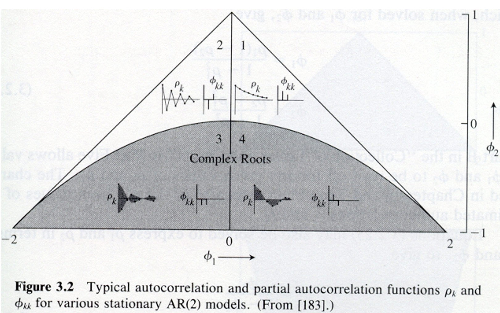

# ARMA

## Autoregressive Moving Average(ARMA)

Combines MA and AR models into one model. An “ARMA(p,q)” model is: 

$$(1-\phi_1B-\phi_2B^2-…-\phi_pB^p)x_t = (1+\theta_1B+\theta_2B^2+…+\theta_qB^q)w_t\\
\iff \phi(B)x_t = \theta(B)w_t$$ 

assuming $x_t$ is stationary.


Notes:

- If $E(x_t) = \mu \ne$ 0, then we could rewrite the model as 

$$\phi(B)x_t = \alpha + \theta(B)w_t$$ where $\alpha = \mu(1-\phi_1-\phi_2-…-\phi_p)$

or let $z_t = x_t-\mu$ so that the model is $\phi(B)z_t = \theta(B)w_t$ 

- If the model is casual, then it can be rewritten as 

$$x_t = \frac{\theta(B)}{\phi(B)}w_t = \psi(B)w_t$$

where $\psi(B) = 1+B\psi_1+B^2\psi_2+… .$ 

- If the model is invertible, then it can be rewritten as 

$$\frac{\phi(B)}{\theta(B)}x_t = \pi(B)x_t = w_t$$, where $\pi(B)=1+\pi_1B+\pi_2B^2+...$

- Problem with parameter redundancy

ARMA(1,1): $(1-0.5B)x_t = (1-0.5B)w_t$

Notice that $x_t = \frac{1-0.5B}{1-0.5B}w_t = w_t$! Thus, this ARMA(1,1) can also be represented by a white noise process.  

Another example illustrating this is the following ARMA(2,1): 

$$(1-0.1B-0.2B^2)x_t = (1-0.5B)w_t\\
\iff (1+0.4B)(1-0.5B)x_t = (1-0.5B)w_t\\
\iff (1+0.4B)x_t = \frac{1-0.5B}{1-0.5B}w_t$$

Thus, this ARMA(2,1) can also be represented by an ARMA(1,0).  

The problem here is that both the AR and MA parts have a “common factor”. To avoid this problem, we need to assume that AR and MA operators have no common factors.

To overcome the problems with stationary AR models that depend on the future and MA models that are not unique, we require ARMA models to be causal and invertible. 

Let $\phi(z) = 1-\phi_1z-\phi_2z^2-…-\phi_pz^p, \phi_p\ne$ 0, and $\theta(z) = 1+\theta_1z+\theta_2z^2+…+\theta_qz^q, \theta_q\ne$ 0
be the AR and MA operators with “z” used in it to emphasize they are as polynomials and z is an ordinary algebraic variable. Note that z is possibly a complex number. 

Assume that $\phi_(z)$ and $\theta(z)$ have no common factors.

## Causality of an ARMA(p,q) process

An ARMA(p,q) model is causal when the roots of $\phi(z)$ lie outside the unit circle; that is, $\phi(z) = 0$ only when |z| > 1.  The coefficients of the linear process for $x_t=\sum_{j=0}^{\infty}\psi_jB^jw_t$  can be determined from solving $\sum_{j=0}^{\infty}\psi_jz^j=\frac{\theta(z)}{\phi(z)}$ .  

Note that when z is a real number, |z| means absolute value of z. When z is a complex number c+di, |z| means $\sqrt{c^2+d^2}$ where i = $\sqrt{-1}$ .  

Again, this means the model can be rewritten as an infinite order MA model.  

Reason: Stationarity that is not future dependent 

The appendix of Shumway and Stoffer’s textbook includes a proof.

## Invertibility of ARMA(p,q) process

An ARMA(p,q) model is invertible when the roots of $\theta(z)$ lie outside the unit circle; that is, $\theta(z) = 0$ only when |z|>1.  The coefficients of the linear process for $\sum_{j=0}^{\infty}\pi_jB^jx_t=w_t$  can be determined from solving $\sum_{j=0}^{\infty}\pi_jz^j=\frac{\phi(z)}{\theta(z)}$ .  

Again, this means the model can be rewritten as an infinite order AR model. 

Reason: Model has a unique representation

The appendix of Shumway and Stoffer’s textbook includes a proof.

:::{.example}

**AR(1), $(1-\phi B)x_t=w_t$**

Causal: Let $\phi(z) = (1-\phi z)$.  Note that $(1-\phi z) = 0$ has a root of $z = \frac{1}{\phi}$. For this to be causal,  

$|\frac{1}{\phi}|>1 \iff -1 < \phi < 1$

Therefore, an AR(1) model is causal if -1 < $\phi$ < 1. Relate this back to earlier in the notes when we used the sum of an infinite series to find the infinite MA representation.   

Invertible: Yes, because the model is already written in terms of an AR only model.  

What happens if the causal conditions are violated? The model will not be causal and thus will not be “backward” stationary.  

Suppose $\phi_1 = 2$ in an AR(1). Then  $x_t=\phi_1x_{t-1}+w_t=2x_{t-1}+w_t$. Using a program similar to ar1.R in Chapter 1 (with $w_t \sim ind. N(0,1)$ and the `for()` function), the data generated from this series produces 

```{r}
set.seed(1381)  
w <- rnorm(n = 200, mean = 0, sd = 1)


x <- numeric(length = 200)
x.1 <- 0
for(i in 1:length(x)) {
    x[i] <- 2*x.1 + w[i]
    x.1 <- x[i]
}

head(data.frame(x, w))
```


Notice that $x_t$ is changing rapidly (not stationary in the mean).  

Note: All AR only models are invertible!
:::

:::{.example}

**AR(2)**

$(1-\phi_1B-\phi_2B^2)x_t=w_t$

Invertible: Yes, because the model is already written in terms of an AR only model.  

Causal: $(1-\phi_1z-\phi_2z^2) = 0$ needs to have roots $z_1$ and $z_2$ outside of the unit circle.  

R has a function called `polyroot()` that can find the roots of a polynomial automatically. Below are some examples of working with it.

```{r}
#Syntax for a AR(2): 1 - phi1*z - phi2*z^2 
#  phi1 = 0.5, phi2 = 0
polyroot(z = c(1, -0.5, 0))   # 1-0.5z

```


```{r}
#Outside unit circle examples - causal
#phi1 = 0, phi2 = 0.5 
polyroot(z=c(1,0,-0.5)) # 1-0.5z^2
```

```{r}
#phi1 = 0, phi2 = -0.5 
polyroot(z = c(1, 0, 0.5))   # 1+0.5z^2
```

```{r}
#phi1 = -0.2, phi2 = -0.5
polyroot(z = c(1, 0.2, 0.5))  # 1+0.2z+0.5z^2
```

```{r}
abs(polyroot(z = c(1, 0.2, 0.5))) #Check if outside 
```

```{r}
sqrt((-0.2)^2+1.4^2) #Verify abs() function did it correctly

```

```{r}
#phi1 = -1, phi2 = -0.5
polyroot(z = c(1, 1, 0.5))  
abs(polyroot(z = c(1, 1, 0.5))) 
```

```{r}
#phi1 = -1.8, phi2 = -0.9
polyroot(z = c(1, 1.8, 0.9))  
abs(polyroot(z = c(1, 1.8, 0.9))) 
```

```{r}
#phi1 = 0.5, phi2 = 0.25 
polyroot(z = c(1, -0.5, -0.25))
abs(polyroot(z = c(1, -0.5, -0.25))) 
```


```{r}
# Inside unit circle examples - not causal
#phi1 = 1.8, phi2 = 0.9
polyroot(z = c(1, -1.8, -0.9))  
abs(polyroot(z = c(1, -1.8, -0.9))) 

```

```{r}
#phi1 = -1.2, phi2 = 0.8
polyroot(z = c(1, 1.2, -0.8))  
abs(polyroot(z = c(1, 1.2, -0.8))) 
```


:::


It can be shown that the conditions are -1 < $\phi_2$ < 1, $\phi_2+\phi_1$ < 1, and $\phi_2-\phi_1$ < 1. Shumway and Stoffer and Wei’s textbooks provides proofs via the quadratic formula. 

Below is a plot of the region from the Box, Jenkins, and Reinsel textbook. The ACF plots (labeled $\rho_k$) inside the triangle show what ACFs would look like.  The other plots inside of the triangle are plots of the “partial” autocorrelation function, which will be discussed later in the course.  



```{r}
#By default, R goes 4% more on y and x-axis limits,
#  These par() options make it stop at specified limits 
par(xaxs = "i", yaxs = "i")

#dummy plot
plot(x = -2, y = -1, xlim = c(-2,2), ylim = c(-1,1), 
    type = "n", frame.plot = FALSE, xlab = 
     expression(phi1[1]), ylab = expression(phi1[2])) 

#abline() draws y = a + bx       
abline(a = 1, b = -1) #Draw line of phi2 = 1 – phi1
abline(a = 1, b =  1) #Draw line of phi2 = 1 + phi1

#Plot the phi1 and phi2 values 
points(x = 0.5, y = 0, pch = 1, col = "red") 
points(x = 0, y = -0.5, pch = 2, col = "darkgreen")
points(x = -0.2, y = -0.5, pch = 2, col = "darkgreen")
points(x = -1, y = -0.5, pch = 2, col = "darkgreen")
points(x = -1.8, y = -0.9, pch = 2, col = "darkgreen")
points(x = 0.5, y = 0.25, pch = 1, col = "red")
   
points(x = 1.8, y = 0.9, pch = 3, col = "blue")
points(x = -1.2, y = 0.8, pch = 3, col = "blue")

legend("bottomright", legend = c("Causal, real roots", 
      "Causal, complex roots", "Not Casual"), pch = 
      c(1,2,3), col = c("red", "darkgreen", "blue"), cex = 
      0.75, bty = "n")

```

:::{.example}

**MA(1)**

$x_t=(1+\theta B)w_t$

Causal: Yes, because the model is already written in terms of an MA only model.  

Invertible: Let $\theta(z) = (1 + \theta z).$  Note that $(1 + \theta z) = 0$ has a root of z = $-\frac{1}{\theta}.$ For this to be invertible,  

$|\frac{-1}{\theta}| > 1 \iff -1 < \theta < 1.$

Therefore, a MA(1) model is invertible if $-1 < \theta < 1$

:::

Notes:

- MA only model will always be causal.
- MA(2) model has similar invertibility conditions as the AR(2) model’s causal conditions.  
- ARMA(1,1) model has the same causal conditions as an AR(1) and the same invertible conditions as a MA(1).  
- ARMA(2,2) model has the same causal conditions as an AR(2) and the same invertible conditions as a MA(2)...  

