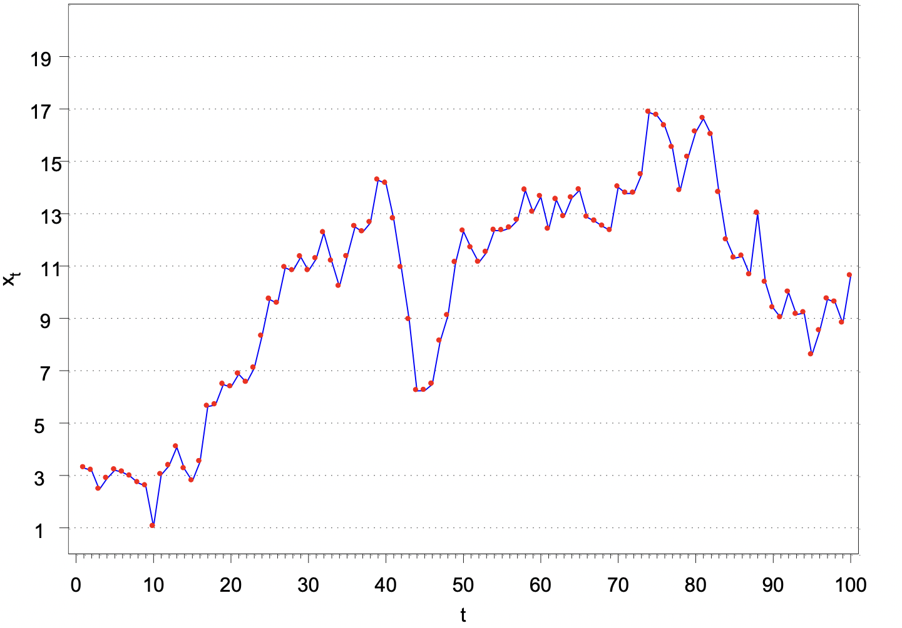
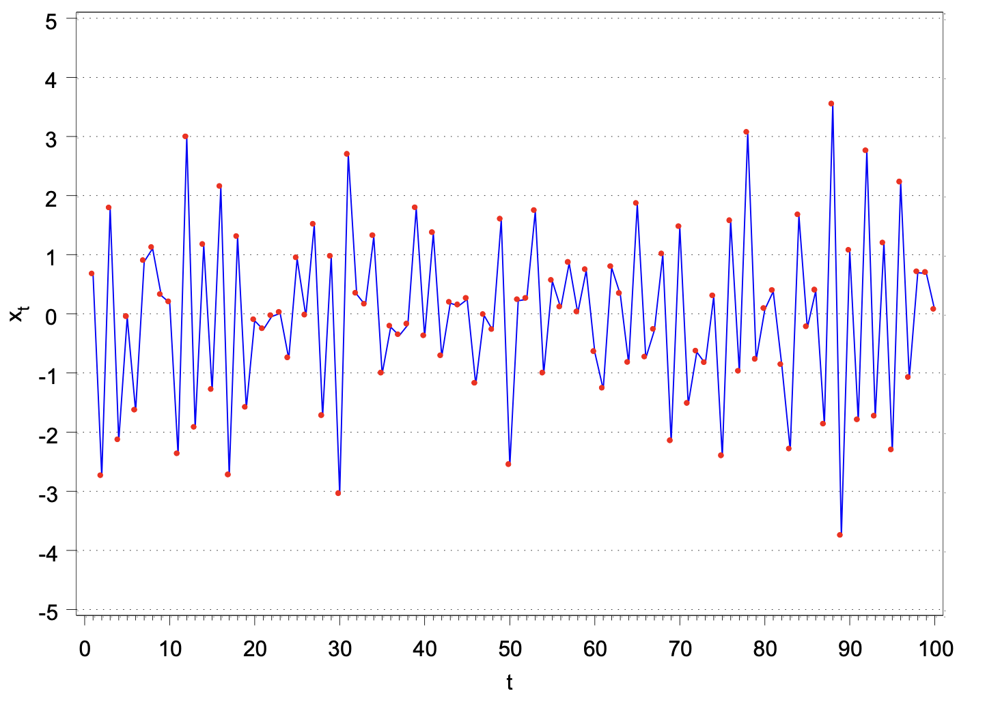
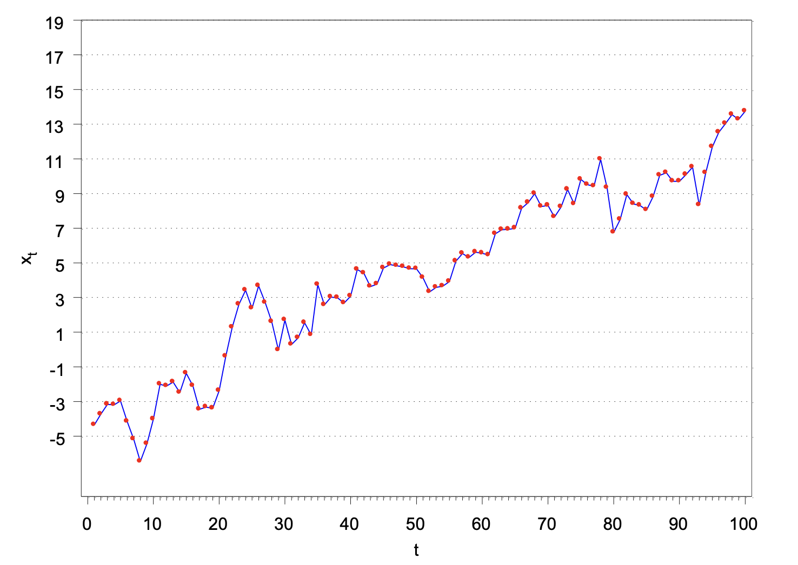
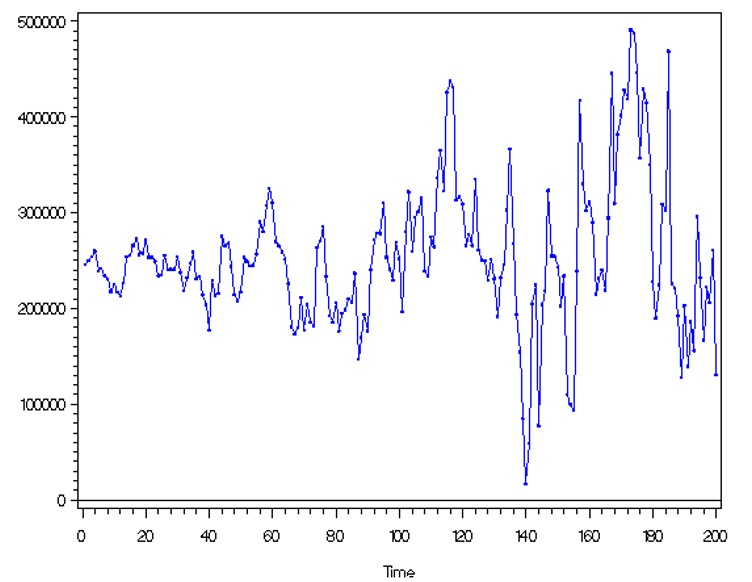

# Stationarity

## Stationarity 

Stationarity is a VERY important concept to understand because it allow us to construct time series models.  

:::{.definition }

**Strictly Stationary**

The probabilistic behavior of $X_{t_1},...,X_{t_k}$ is exactly the same as that of the shifted set $X_{t_{1+h}},...,X_{t_{k+h}}$  for ANY collection of time points t1,…, tk, for ANY k = 1, 2, …, and for ANY shift h = 0, $\pm$ 1, $\pm$ 2, … .

Let $c_1,…, c_k$ be constants. Then$$P(X_{t_1}\leq{c_1},...,X_{t_k}\leq{c_k})=P(X_{t_{1+h}}\leq{c_{1}},...,X_{t_{k+h}}\leq{c_k})$$ 

i.e., the probability distribution is INVARIANT to time shifts. 
:::

e.g. $P(X_1\leq{c_1}, X_2\leq{c_2})=P(X_{10}\leq{c_1}, X_{11}\leq{c_2})$

Requiring a time series to be strictly stationary is VERY restrictive! A less restrictive requirement is weakly stationary.  

:::{.definition }

**Weakly Stationary**

The first two moments (mean and covariance) of the time series are invariant to time shifts. $$E(X_t)=\mu, \forall t$$ and $$ \gamma(t,t+h)=\gamma(0,h), \forall t$$
:::

Notes:

- $\mu$ and $\gamma(0,h)$ are NOT functions of t.  
- h is the lag  
- $\gamma(t, t+h)$ = $\gamma(0,h)$ for ALL time t means that the autocovariance function ONLY depends on the number of lags of the time shift. Thus,$\gamma(0,h) = \gamma(1, h+1) = \gamma(2, 2+h) = \gamma(3, 3+h) = …$
- Because we will generally be dealing with a weakly stationary time series, we can make the following notational change: $\gamma(h)=\gamma(0,h)=\gamma(t, t+h).$  
- The variance of $X_t$ is $\gamma(0)$.
- The same notational change can be made to the autocorrelation function (ACF). Thus, $\rho(h)$ denotes the ACF at lag h. Note that$$\rho(h)=\rho(t,t+h)=\frac{\gamma(t,t+h)}{\sqrt{\gamma(t,t)}\sqrt{\gamma(t+h,t+h)}}=\frac{\gamma(h)}{\sqrt{\gamma(0)}\sqrt{\gamma(0)}}=\frac{\gamma(h)}{\gamma(0)}$$

- Strictly stationary implies weakly stationary, but the reverse is not necessarily true.  
- Frequently, we will just say “stationary” to refer to weakly stationary and say the full “strictly stationary” to refer to strictly stationary.

:::{.example }
**White Noise**
Suppose $w_t \sim ind. N(0,\sigma^2_w ), t=1,…,n.$ Is this a weakly stationary time series? 

Yes – mean is 0 for all wt, variance is constant for all wt, and the covariance is 0 because the random variables are independent. AND, it is also strictly stationary. 

:::

:::{.example }

**Moving Average**

Let $m_t=\frac{w_t+w_{t-1}+w_{t-2}}{3}, w_t \sim ind. N(0,1 ), t=1,…,n$

Previously, we found that $\mu_t=0, \forall t$ and 

$$\begin{cases}
  \gamma(s,t)= \frac{3}{9} & \text{if } s=t \\
  \gamma(s,t)= \frac{2}{9} & \text{if } |s-t|=1\\
  \gamma(s,t)= \frac{1}{9} & \text{if } |s-t|=2\\
  \gamma(s,t)= 0 & \text{if } |s-t|\ge 3\\
\end{cases}$$

Is the time series weakly stationary? Hint: let h=s-t. 

Yes! You can see that $\gamma(s,t)$ only depends on h.

:::

Comments: 

- $\gamma(h) = \gamma(-h)$ for all h if the series is weakly stationary. This means that it does not matter which way the shift occurs.  
- Stationarity can also be examined when two time series are of interest. We will examine this in more detail later in the course.

In summary,  

- Both time series must have constant mean
- Both autocovariance functions must depend only on the lag difference
- The “cross-covariance” function, the extension of the autocovariance function for one time series to two time series, must depend only on the lag difference. The cross-covariance function is defined as 

$$\gamma_{xy}(h) = E[(x_{t+h} – \mu_x)(y_t – \mu_y)]$$

Note that $\gamma_{xy}(h)$  is not necessarily equal to $\gamma_{yx}(h)$  (usually will be different).

:::{.example }

Let $x_t = w_t + w_{t-1}$ and $y_t = w_t - w_{t-1}$, where $w_t \sim \mathrm{ind}N(0,\sigma^2_w )$ for t = 1, …, n

Claim: $x_t$ and $y_t$ are weakly stationary.
:::

:::{.proof }
- $X_t$

$E(X_t)=E(w_t+w_{t-1})=E(w_t+w_{t-1})=0+0=0$
Thus $E(X_t)=\mu_{X_t}=0 \forall t$

$\gamma(s,t)=E[(X_s-\mu_{X_s})(X_t-\mu_{X_t})]\\=E[X_sX_t]=E[(w_s+w_{s+1})(w_t+w_{t+1})]\\=E[w_sw_t+w_{s-1}w_t+w_sw_{t-1}+w_{s-1}w_{t-1}]$

if s=t, then $\gamma(t,t)=E[w^2_t+ w_{t-1}w_t + w_tw_{t-1} +  w^2_{t-1}]\\= Var(w_t) + (E[w_t])^2 + 2E[w_{t-1}]E[w_t] + Var(w_{t-1}) + (E[w_{t-1}])^2\\= \sigma^2_w + 0 + 0 + \sigma^2_w + 0= 2\sigma^2_w$

if s=t-1, then $\gamma(t-1,t)=E[w_{t-1}w_t+ w_{t-2}w_t + w^2_{t-1} +  w_{t-2}w_{t-1}]\\= E[w_{t-1}]E[w_t] + E[w_{t-2}]E[w_t] + Var(w_{t-1}) +(E[w_{t-1}])^2 + E[w_{t-2}]E[w_{t-1}]\\=  0 + 0 + \sigma^2_w + 0+0=\sigma^2_w$

Note that $\gamma(t - 1, t) = \sigma^2_w$  and $\gamma(s,t) = 0$ for |s - t|>1.  

$$\begin{cases}
  \gamma(s,t)= 2\sigma^2_w & \text{if } s=t \\
  \gamma(s,t)= \sigma^2_w & \text{if } |s-t|=1\\
  \gamma(s,t)= 0 & \text{if } |s-t| > 1\\
\end{cases}$$

$X_t$ is weakly stationary.

- $Y_t$

$E(Y_t)=E(w_t-w_{t-1})=E(w_t-w_{t-1})=0-0=0$
Thus $E(Y_t)=\mu_{Y_t}=0 \forall t$

$\gamma(s,t)=E[(Y_s-\mu_{Y_s})(Y_t-\mu_{Y_t})]=E[Y_sY_t]\\=E[(w_s-w_{s+1})(w_t-w_{t+1})]=\\E[w_sw_t-w_{s-1}w_t-w_sw_{t-1}+w_{s-1}w_{t-1}]$

if s=t, then $\gamma(t,t)=E[w^2_t- w_{t-1}w_t - w_tw_{t-1} +  w^2_{t-1}]\\= Var(w_t) + (E[w_t])^2 - 2E[w_{t-1}]E[w_t] + Var(w_{t-1}) + (E[w_{t-1}])^2\\= \sigma^2_w + 0 - 0 + \sigma^2_w + 0= 2\sigma^2_w$

if s=t-1, then $\gamma(t-1,t)=E[w_{t-1}w_t- w_{t-2}w_t - w^2_{t-1} +  w_{t-2}w_{t-1}]\\ = E[w_{t-1}]E[w_t] - E[w_{t-2}]E[w_t] - Var(w_{t-1}) -(E[w_{t-1}])^2 + E[w_{t-2}]E[w_{t-1}]\\=  0 - 0 - \sigma^2_w - 0+0=-\sigma^2_w$

Note that $\gamma(t - 1, t) = -\sigma^2_w$  and $\gamma(s,t) = 0$ for |s - t|>1.  

$$\begin{cases}
  \gamma(s,t)= 2\sigma^2_w & \text{if } s=t \\
  \gamma(s,t)= -\sigma^2_w & \text{if } |s-t|=1\\
  \gamma(s,t)= 0 & \text{if } |s-t| > 1\\
\end{cases}$$

$Y_t$ is weakly stationary.
:::

## Linear Process

The previous examples are special cases of a “linear process”. In general, a linear process can be defined as $$X_t=\mu+ \sum_{j=-\infty}^{\infty} \psi_jw_{t-j}, \sum_{j=-\infty}^{\infty}|\psi_j|<\infty$$ and $$w_t\sim\mathrm{ind.}N(0,\sigma^2_w)$$

It can be shown that $\gamma(h)=\sigma^2_w\sum_{j=-\infty}^{\infty}\psi_{j+h}\psi_j$ for h $\geq$ 0 provided the series is stationary (remember that and $\gamma(h) = \gamma(-h)$).

:::{.proof }

WLOG, let $\mu=0$, since constants do not affect a covariance.

$E(X_t)=E(\mu+\sum_{j=-\infty}^{\infty} \psi_jw_{t-j})\\=0+\sum_{j=-\infty}^{\infty} \psi_jE(w_{t-j})\\=0+\sum_{j=-\infty}^{\infty} \psi_j0=0$

Note that $\gamma(h) = Cov(x_t, x_{t+h}) = E(x_tx_{t+h}) – E(x_t)E(x_{t+h}) = E(x_tx_{t+h})$ since $E(x_t) = E(x_{t+h}) = 0$

Then $E(x_tx_{t+h})=E[(\sum_{i=-\infty}^{\infty}\psi_iw_{t-i})(\sum_{i=-\infty}^{\infty}\psi_jw_{t+h-j})]\\=E[\sum_{i=-\infty}^{\infty}\sum_{j=-\infty}^{\infty}\psi_i\psi_jw_{t-i}w_{t+h-j}]\\=\sum_{i=-\infty}^{\infty}\sum_{j=-\infty}^{\infty}\psi_i\psi_jE(w_{t-i}w_{t+h-j})\\=\sigma^2_w\sum_{k=-\infty}^{\infty}\psi_k\psi_{k+h}$

Note that $E(w_{t-i}w_{t+h-j})=0, \forall -i\ne{h-j}$ and $E(w_{t-i}w_{t+h-j})=E(w^2_{t-i})=\sigma^2_w ,\forall -i=h-j ( i.e.,j-i=h)$ and $\psi's$ are constants.

Hence, $\gamma(h)=\sigma^2_w\sum_{j=-\infty}^{\infty}\psi_{j+h}\psi_j$ for h $\geq$ 0.
:::

Important:

There is a very important case when weakly stationary implies strictly stationary. This occurs when the time series has a multivariate normal distribution. Remember that a univariate normal distribution is defined only by its mean and variance. The multivariate normal distribution is defined only by its mean vector and covariance matrix.  

Thus, if we can assume a multivariate normal distribution, we ONLY need to check if the time series satisfies the weakly stationary requirements to say the time series is strongly stationary. Thus, notice what the word “stationary” would mean in this case. 

:::{.example }

**Visualizing Stationarity**

Below are a few plots of the observed values of a time series. Identify which plots correspond to a weakly stationary series.

This graph violates weakly stationary. It seems that there's a structural change. You can find there are two distinct mean: high mean and low mean. 

This graph doesn't seem to violate weakly stationary, as you can see the mean seems to be a constant 0 and the variablity seems to be a constant across different time points. 

Clearly, this violates weakly stationary. You can see the mean keeps changing.

Clearly, this violates weakly stationary. You can see the variance keeps changing.

:::

It is important to have stationarity b/c it allows us to estimate the mean and variance and we need consistency to construct a model.

