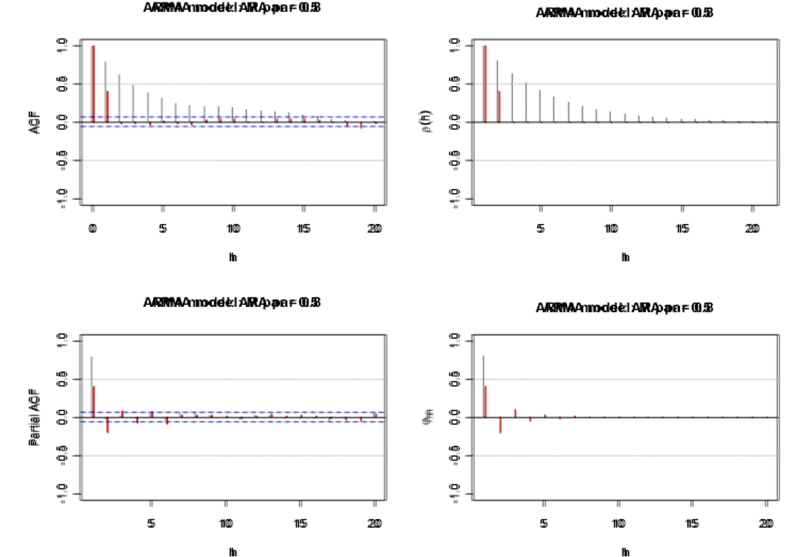

# ACF and PACF for ARMA models

We will examine the ACF and PACF (a new function) for a specific ARMA process. We can compare these values to their corresponding estimated values from an observed time series. Values and patterns that tend to match the best between the ARMA model and the observed time series suggest a particular model to use for the data.

## ACF for MA(q)

Below is the derivation

$$x_t=\theta(B)w_t\\
=(1+\theta_1B+\theta_2B^2+...+\theta_qB^q)\\
=\sum_{j=0}^{q}\theta_jB^jw_t$$ with $\theta_0=1$ and $w_t\sim ind(0,\sigma_w^2)$

Note that $\gamma(h)=Cov(x_t,x_{t+h})=E(x_tx_{t+h})-E(x_t)E(x_{t+h})=E(x_tx_{t+h})$ since $E(x_t)=E(x_{t+h})=0$

When 0 $\le$ h $\le$ q,

$$E(x_tx_{t+h})\\
=E[(\sum_{i=0}^{q}\theta_iB^iw_t)(\sum_{j=0}^{q}\theta_jB^jw_{t+h})]\\
=E[\sum_{i=0}^{q}\sum_{j=0}^{q}\theta_i\theta_jw_{t-i}w_{t+h-j}]\\
=\sum_{i=0}^{q}\sum_{j=0}^{q}\theta_i\theta_jE[w_{t-i}w_{t+h-j}]\\
=\sigma_w^2\sum_{i=0}^{q-h}\theta_i\theta_{i+h}$$

The last term comes about because $E(w_{t-i}w_{t+h-j}) = 0$ when -i $\ne$ h-j and $E(w_{t-i}w_{t+h-j}) = E(w_{t-i}^2) = \sigma_w^2$ when -i = h-j $\implies$ j = i+h. One can write out the indices for the summation and then try h = 0, h = 1, … to see there are q - h pairs of indices that match up each time.

Therefore,

\[
\gamma(h)=
\begin{cases}
    \sigma_w^2\sum_{i=0}^{q-h}\theta_i\theta_{i+h} & \text{if } 0 \le h \le q \\
    \ 0 & \text{if } h>q \\
\end{cases}
\]

Note that $\gamma(0)=\sigma_w^2\sum_{i=0}^{q}\theta_i^2.$ The ACF is

\[
\rho(h)=\frac{\gamma(h)}{\gamma(0)}=\
\begin{cases}
    \frac{\sum_{i=0}^{q-h}\theta_i\theta_{i+h}}{\sum_{i=0}^{q}\theta_i^2} & \text{if } 0 \le h \le q \\
    \ 0 & \text{if } h>q \\
\end{cases}
\]

Notes: 

- This derivation could have been directly from the linear process result examined earlier;   where it can be shown that $\gamma(h)=\sigma_w^2\sum_{-\infty}^{\infty}\psi_{j+h}\psi_j$ for h $\ge$ 0.

- For a MA(1): $\gamma(h)=\sigma_w^2\sum_{i=0}^{1-h}\theta_i\theta_{i-h}$ for h = 0, 1. Then 
  - $\gamma(0) =\sigma_w^2(\theta_0^2+\theta_1^2)=\sigma_w^2(1+\theta_1^2)$ where $\theta_0 = 1$,
  - $\gamma(1) =\sigma_w^2(\theta_0\theta_1)=\sigma_w^2\theta_1$, and   
  - $\gamma(h) = 0$ for h > 1.  
  - The ACF is $\rho(0) = 1, \rho(1) =\frac{\theta_1}{1+\theta_1^2},$ and $\rho(h) = 0$ for h > 1.  
  - Plots from ma1_sim.R using MA(1): 
  

```r
set.seed(8199)
x <- arima.sim(model = list(ma = c(0.7)), n = 100, rand.gen = rnorm, sd = 10)
  
dev.new(width = 8, height = 6, pointsize = 10)  #Opens up wider plot window than the default (good for time series plots)
plot(x = x, ylab = expression(x[t]), xlab = "t", type = "l", col = c("red"),
     main = expression(paste(x[t] == w[t] + 0.7*w[t-1], " where ", w[t], 
                             " ~ ind.N(0,100)")), 
     panel.first=grid(col="gray",lty="dotted"))

points(x = x, pch = 20, col = "blue")
```
  

```r
round(ARMAacf(ma = c(0.7), lag.max = 20),4)
```

```
##      0      1      2      3      4      5      6      7      8      9     10 
## 1.0000 0.4698 0.0000 0.0000 0.0000 0.0000 0.0000 0.0000 0.0000 0.0000 0.0000 
##     11     12     13     14     15     16     17     18     19     20 
## 0.0000 0.0000 0.0000 0.0000 0.0000 0.0000 0.0000 0.0000 0.0000 0.0000
```

```r
round(ARMAacf(ma = c(-0.7), lag.max = 20),4) 
```

```
##       0       1       2       3       4       5       6       7       8       9 
##  1.0000 -0.4698  0.0000  0.0000  0.0000  0.0000  0.0000  0.0000  0.0000  0.0000 
##      10      11      12      13      14      15      16      17      18      19 
##  0.0000  0.0000  0.0000  0.0000  0.0000  0.0000  0.0000  0.0000  0.0000  0.0000 
##      20 
##  0.0000
```

  

```r
par(mfrow = c(1,2))


plot(y = ARMAacf(ma = c(0.7), lag.max = 20), x = 0:20, type = "h", ylim = c(-1,1), xlab = "h", ylab = expression(rho(h)),
       main = expression(paste("ACF for MA(1) with ", theta[1] == 0.7)))
abline(h = 0)


plot(y = ARMAacf(ma = c(-0.7), lag.max = 20), x = 0:20, type = "h", ylim = c(-1,1), xlab = "h", ylab = expression(rho(h)),
       main = expression(paste("ACF for MA(1) with ", theta[1] == -0.7)))
abline(h = 0)
```

<!-- --> 


```r
# PACF
round(ARMAacf(ma = c(0.7), lag.max = 20, pacf = TRUE),4)
```

```
##  [1]  0.4698 -0.2832  0.1856 -0.1260  0.0869 -0.0604  0.0421 -0.0294  0.0206
## [10] -0.0144  0.0101 -0.0071  0.0049 -0.0035  0.0024 -0.0017  0.0012 -0.0008
## [19]  0.0006 -0.0004
```

```r
round(ARMAacf(ma = c(-0.7), lag.max = 20, pacf = TRUE),4) 
```

```
##  [1] -0.4698 -0.2832 -0.1856 -0.1260 -0.0869 -0.0604 -0.0421 -0.0294 -0.0206
## [10] -0.0144 -0.0101 -0.0071 -0.0049 -0.0035 -0.0024 -0.0017 -0.0012 -0.0008
## [19] -0.0006 -0.0004
```


```r
# PACF
par(mfrow = c(1,2))

plot(x = ARMAacf(ma = c(0.7), lag.max = 20, pacf = TRUE), type = "h", ylim = c(-1,1), xlab = "h", ylab = expression(phi[hh]),
       main = expression(paste("PACF for MA(1) with ", theta[1] == 0.7)))
abline(h = 0)


plot(x = ARMAacf(ma = c(-0.7), lag.max = 20, pacf = TRUE), type = "h", ylim = c(-1,1), xlab = "h", ylab = expression(phi[hh]),
       main = expression(paste("PACF for MA(1) with ", theta[1] == -0.7)))
  
abline(h = 0)
```

<!-- --> 


- Suppose you observed a time series. The estimated values of the ACF are  $\hat{\rho}(1) \ne$ 0 and  $\hat{\rho}(h) \approx$ 0 for h > 1.  What may be a good model for the data? MA(1)
- For a MA(2):$\gamma(h)=\sigma_w^2\sum_{i=0}^{2-h}\theta_i\theta_{i+h}$. Then 
  - $\gamma(0) = \sigma_w^2(1+\theta_1^2+\theta_2^2)$, 
  - $\gamma(1) = \sigma_w^2(\theta_1+\theta_1\theta_2)$, 
  - $\gamma(2) = \sigma_w^2\theta_2$, and
  - $\gamma(h) = 0$ for h>2.  
  - The ACF is $\rho(0) = 1$, $\rho(1) = \frac{\theta_1+\theta_1\theta_2}{1+\theta_1^2+\theta_2^2}$, $\rho(2) = \frac{\theta_2}{1+\theta_1^2+\theta_2^2}$, and $\rho(h) = 0$ for h > 2.  
- For a MA(q): $\rho(h) = 0$ for h > q.  
- Suppose you observed a time series. The estimated values of the ACF are $\hat{\rho}(1) \ne$ 0,$\hat{\rho}(2) \ne$ 0, and $\hat{\rho}(h) \approx$ 0 for h > 2. What may be a good model for the data? MA(2)

## ACF for casual ARMA(p,q)

Below is the derivation.

First, rewrite the model as an infinite order MA!  

$$\phi(B)x_t = \theta(B)w_t \implies x_t = \frac{\theta(B)}{\phi(B)}w_t \implies x_t = \psi(B)w_t$$

where $w_t \sim ind(0,\sigma_w^2)$ for t = 1, …, n

$\psi(B) = 1 + B\psi_1 + B^2\psi_2 + …$

We can re-write the model as $$x_t=\sum_{i=0}^{\infty}\psi_iB^iw_t$$ with $\psi_0=1$

Note that $E(x_t)=0$.

Then $$\gamma(h)=Cov(x_t,x_{t+h})=E(x_tx_{t+h})\\
=E[(\sum_{i=0}^{\infty}\psi_iB^iw_t)(\sum_{j=0}^{\infty}\psi_jB^jw_{t+h})]\\
E[\sum_{i=0}^{\infty}\sum_{j=0}^{\infty}\psi_i\psi_jw_{t-i}w_{t+h-j}]\\
=\sum_{i=0}^{\infty}\sum_{j=0}^{\infty}\psi_i\psi_jE(w_{t-i}w_{t+h-j})\\
=\sigma_w^2\sum_{i=0}^{\infty}\psi_i\psi_{i+h}$$

because $E(w_{t-i}w_{t+h-j})=0$ when -i $\ne$ h-j and $E(w_{t-i}w_{t+h-j})=E(w_{t-i}^2)=\sigma_w^2$ when -i=h-j $\implies$ j=i+h

Look how similar this is to the proof for MA(q) and for a linear process in general!  

To find the autocovariance function for any ARMA process, we can transform the model into an infinite order MA and find the $\psi$’s!

Another interesting way to solve for the autocovariance function:

$$x_t=\sum_{j=1}^{p}\phi_jB^jx_t+\sum_{j=0}^{q}\theta_jB^jw_t\\
=\sum_{j=1}^{p}\phi_jx_{t-j}+\sum_{j=0}^{q}\theta_jw_{t-j}$$ where $\phi_0=1$ and $\theta_0=1$

$$\gamma(h)=Cov(x_{t+h},x_t)\\
=E[(\sum_{j=1}^{p}\phi_jx_{t+h-j}+\sum_{j=0}^{q}\theta_jw_{t+h-j})x_t]$$

Because $$E(x_t)=0, \phi(B)x_t=\theta(B)w_t\iff x_t=\phi_1x_{t-1}+...+\phi_px_{t-p}+w_t+\theta_1w_{t-1}+...+\theta_qw_{t-q}\\
\implies x_{t+h}=\sum_{j=1}^{p}\phi_jx_{t+h-j}+\sum_{j=0}^{q}\theta_jw_{t+h-j}$$

Then $$\gamma(h)\\
=E(\sum_{j=1}^{p}\phi_jx_tx_{t+h-j})+E(\sum_{j=0}^{q}\theta_jx_tw_{t+h-j})\\
=\sum_{j=1}^{p}\phi_jE(x_tx_{t+h-j})+\sum_{j=0}^{q}\theta_jE(x_tw_{t+h-j})\\
=\sum_{j=1}^{p}\phi_j\gamma(h-j)+\sum_{j=0}^{q}\theta_jE(w_{t+h-j}\sum_{i=0}^{\infty}\psi_iw_{t-i})$$ because $\gamma(h-j)=E(x_tx_{t+h-j})-E(x_t)E(x_{t+h-j})=E(x_tx_{t+h-j})-0$ and $x_t=\psi(B)w_t$

So $$\gamma(h)\\
=\sum_{j=1}^{p}\phi_j\gamma(h-j)+\sigma_w^2\sum_{j=h}^{q}\theta_j\psi_{j-h}$$ for h $\ge$ 0, because we only need the non-zero element of $E(w_{t+h-j}\sum_{i=0}^{\infty}\psi_iw_{t-i})$ occurs when -i = h-j $\iff$ i = j-h and $\psi_i = 0$ for i < 0  

Thus, $\gamma(h)=\sum_{j=1}^{p}\phi_j\gamma(h-j)+\sigma_w^2\sum_{j=h}^{q}\theta_j\psi_{j-h}$ for $0 \le h<max(p, q+1)$ and $\gamma(h)=\sum_{j-1}^{p}\phi_j\gamma(h-j)$ for $h \ge max(p,q+1)$

Note: Dividing the above by $\gamma(0)$ produces $\rho(h)$!

:::{.example}

**ACF from casual ARMA(1,1) **

- $(1-B\phi_1)x_t = (1+\theta_1B)w_t$ where $w_t\sim ind.(0, \sigma_w^2)$ for t = 1, …, n

- Note that $x_t=\frac{1+\theta_1B}{1-\phi_1B}w_t$ can be rewritten as $x_t = \psi(B)w_t.$  Then $(1+\psi_1B+\psi_2B^2+…)(1-\phi_1B) = 1+\theta_1B$. By multiplying out, we obtain

$$1 + \psi_1B + \psi_2B^2 + … 
-\phi_1B - \phi_1\psi_1B^2 - \phi_1\psi_2B^3 - … = 1+\theta_1B$$

Equating terms produces

$B: \theta_1=\psi_1-\phi_1 \implies \psi_1=\theta_1+\phi_1$

$B^2: 0=\psi_2-\phi_1\psi_1 \implies \psi_2= \phi_1(\theta_1+\phi_1)$

$B^3: 0=\psi_3-\phi_1\psi_2 \implies \psi_3= \phi_1[\phi_1(\theta_1+\phi_1)] =  \phi_1^2(\theta_1+\phi_1)$

We can use this result to find the autocovariances:
 
$\gamma(h)=\sigma_w^2\sum_{i=0}^{\infty}\psi_i\psi_{i+h}$

$$\gamma(0)=\sigma_w^2\sum_{i=0}^{\infty}\psi_i\psi_{i+0}\\
=\sigma_w^2[1+(\theta_1+\phi_1)^2+\phi_1^2(\theta_1+\phi_1)^2+\phi_1^4(\theta_1+\phi_1)^2+...]\\
=\sigma_w^2[1+\frac{(\theta_1+\phi_1)^2}{1-\phi_1^2}]\\
=\frac{\sigma_w^2}{1-\phi_1^2}[1-\phi_1^2+\theta_1^2+2\theta_1\phi_1+\phi_1^2]\\
=\frac{\sigma_w^2}{1-\phi_1^2}[1+\theta_1^2+2\theta_1\phi_1]$$

$$\gamma(1)=\sigma_w^2\sum_{i=0}^{\infty}\psi_i\psi_{i+1}=\sigma_w^2(\psi_0\psi_1+\psi_1\psi_2+\psi_2\psi_3+...)\\
=\sigma_w^2[(\theta_1+\phi_1)+\phi_1(\theta_1+\phi_1)^2+\phi_1^3(\theta_1+\phi_1)^2+...]\\
=\sigma_w^2[(\theta_1+\phi_1)+\frac{\phi_1(\theta_1+\phi_1)^2}{1-\phi_1^2}]\\=\frac{\sigma_w^2(\theta_1+\phi_1)}{1-\phi_1^2}[1-\phi_1^2+\phi_1\theta_1+\phi_1^2]\\=\frac{\sigma_w^2(\theta_1+\phi_1)(1+\phi_1\theta_1)}{1-\phi_1^2}$$

- $(1-B\phi_1)x_t=(1+\theta_1B)w_t$ can be rewritten as 
 
$x_t = \phi_1x_{t-1} + w_t + \theta_1w_{t-1}$

Then $\gamma(h)=\sum_{j=i}^{1}\phi_j\gamma(h-j)+\sigma_w^2\sum_{j=h}^{1}\theta_j\psi_{j-h}= \phi_1\gamma(h-1) + \sigma_w^2\sum_{j=h}^{1}\theta_j\psi_{j-h}$ where $\theta_0 = 1$.

Thus, 

$$\gamma(0) = \phi_1\gamma(-1) +  \sigma_w^2(\theta_0\psi_0 + \theta_1\psi_1)\\ 
= \phi_1\gamma(1) +  \sigma_w^2(1+ \theta_1\psi_1)\\
= \phi_1\gamma(1) +  \sigma_w^2[1+ \theta_1(\theta_1+\phi_1)]\\
= \phi_1\gamma(1) +  \sigma_w^2[1+ \theta_1^2 +\theta_1\phi_1]$$

and

$$\gamma(1) = \phi_1\gamma(0) +  \sigma_w^2\theta_1\psi_0\\ 
= \phi_1\gamma(0) +  \sigma_w^2\theta_1$$ because $\psi_0 = 1$.  

- Solving for $\gamma(0)$ produces: 

$$\gamma(0)=\phi_1\gamma(1)+\sigma_w^2[1+\theta_1^2+\theta_1\phi_1]\\
= \phi_1[\phi_1\gamma(0) +  \sigma_w^2\theta_1] +  \sigma_w^2[1+ \theta_1^2 +\theta_1\phi_1] \\
\implies \gamma(0) -  \phi_1^2\gamma(0) =  \sigma_w^2\phi_1\theta_1 +  \sigma_w^2[1+\theta_1^2+\theta_1\phi_1]\\
\implies \gamma(0)(1 - \phi_1^2 ) =  \sigma_w^2[\phi_1\theta_1 + 1+ \theta_1^2 +\theta_1\phi_1]\\
\implies \gamma(0) =  \frac{\sigma_w^2}{1-\phi_1^2}[\theta_1^2+2\theta_1\phi_1+1]$$

- Solving for $\gamma(1)$ produces: 

$$\gamma(1) = \phi_1\gamma(0) +  \sigma_w^2\theta_1 \\
= \phi_1\frac{\sigma_w^2}{1-\phi_1^2}[\theta_1^2+2\theta_1\phi_1+1]+\sigma_w^2\theta_1 \\
= \sigma_w^2[\frac{\phi_1(\theta_1^2+2\theta_1\phi_1+1)}{1-\phi_1^2}+\theta_1] \\
= \sigma_w^2[\frac{\phi_1\theta_1^2+2\theta_1\phi_1^2+\phi_1+\theta_1-\theta_1\phi_1^2}{1-\phi_1^2}]\\
= \sigma_w^2\frac{(1+\theta_1\phi_1)(\phi_1+\theta_1)}{1-\phi_1^2} $$

- Note that $\gamma(h) = \sum_{j=1}^{1}\phi_j\gamma(h-j)$for h $\ge$ max(1, 2). Then $\gamma(2) = \phi_1\gamma(1), \gamma(3) = \phi_1\gamma(2), …$

Thus, 

\[
\gamma(h)=
\begin{cases}
  \frac{\sigma_w^2}{1-\phi_1^2}[\theta_1^2+2\theta_1\phi_2+1]   & \text{if } h=0 \\
  \sigma_w^2\phi_1^{h-1}\frac{(1+\theta_1\phi_1)(\phi_1+\theta_1)}{1-\phi_1^2}  & \text{if } h>0 \\
\end{cases}
\]
 

- Finally, 
$$\rho(h) =\frac{\sigma_w^2\phi_1^{h-1}\frac{(1+\theta_1\phi_1)(\phi_1+\theta_1)}{1-\phi_1^2}}{\frac{\sigma_w^2}{1-\phi_1^2}[\theta_1^2+2\theta_1\phi_1+1]}\\
=\frac{\phi_1^{h-1}(1+\theta_1\phi_1)(\phi_1+\theta_1)}{\theta_1^2+2\theta_1\phi_1+1}$$   
for h $\ge$ 1


:::

Notes:

- Unlike the ACF for a MA(q), this is not 0 after a particular lag.  
- Why do we want to know the ACF of an ARMA(1,1)? If the estimated ACF of a time series data set exhibits similar characteristics (i.e, does not “cut off” to 0, but rather “tails off” to 0), then we may think the time series data set can be modeled with an ARMA(1,1)!  


:::{.example}

**ACF of an AR(p)**

- Because q = 0, the autocovariance function is 

$$\gamma(0) =\sum_{j=1}^{p}\psi_j\gamma(h-j)+\sigma_w^2\sum_{j=0}^{0}\theta_j\psi_{j-0}\\
=\sum_{j=1}^{p}\phi_k\gamma(h-j)+\sigma_w^2$$   

and $\gamma(h) =\sum_{j=1}^{p}\phi_j\gamma(h-j)$ for h $\ge$ 1.

- Suppose p = 1. Then $\gamma(0) =\phi_1\gamma(-1)+\sigma_w^2 = \phi_1\gamma(1)+\sigma_w^2$, 
$\gamma(1) = \phi_1\gamma(0), \gamma(2) = \phi_1\gamma(1), …$ 

Thus, $\gamma(0) =  \phi_1\gamma(1)+\sigma_w^2 =   \phi_1^2\gamma(0)+\sigma_w^2 \implies \gamma(0)=\frac{\sigma_w^2}{1-\phi_1^2}$.  

Also, $\gamma(1) =\frac{\phi_1\sigma_w^2}{1-\phi_1^2}, \gamma(2) =\frac{\phi_1^2\sigma_w^2}{1-\phi_1^2}, …$ 

Finally, $\gamma(h) = \frac{\phi_1^h\sigma_w^2}{1-\phi_1^2}$

The ACF is $\rho(h) = \frac{\gamma(h)}{\gamma(0)}=\frac{\frac{\phi_1^h\sigma_w^2}{1-\phi_1^2}}{\frac{\sigma_w^2}{1-\phi_1^2}}=\phi_1^h$
  
Remember that -1 < $\phi_1$ < 1 to ensure stationarity. Notice how $\rho(h)$ will slowly “tail off” to 0. While tailing off, it can be alternating between positive and negative values.  


- Suppose p=2. Then

$$\gamma(0)=\sum_{j=1}^{2}\phi_j\gamma(0-j)+\sigma_w^2\sum_{j=0}^{0}\theta_j\psi_{j=0}\\
=\phi_1\gamma(-1)+\phi_2\gamma(-2)+\sigma_w^2\\
=\phi_1\gamma(1)+\phi_2\gamma(2)+\sigma_w^2,$$

$\gamma(1) = \phi_1\gamma(0) + \phi_2\gamma(-1) = \phi_1\gamma(0) + \phi_2\gamma(1),$

$\gamma(2) = \phi_1\gamma(1) + \phi_2\gamma(0),$

$\gamma(3) = \phi_1\gamma(2) + \phi_2\gamma(1),$

Then$\rho(h)=\frac{\gamma(h)}{\gamma(0)}=\phi_1\rho(h-1)+\phi_2\rho(h-2)$ for h $ge$ 1.

Therefore, 
$\rho(1) = \phi_1\rho(0) + \phi_2\rho(-1) = \phi_1 + \phi_2\rho(1) \implies \rho(1) = \frac{\phi_1}{1-\phi_2}.$  

$\rho(2) = \phi_1\rho(1) + \phi_2\rho(0) = \frac{\phi_1^2}{1-\phi_2} + \phi_2 =\frac{\phi_1^2+\phi_2-\phi_2^2}{1-\phi_2}$  

Remember that -1 < $\phi_2$ < 1, $\phi_2 + \phi_1$ < 1, and $\phi_2 - \phi_1$ < 1 to ensure stationarity. Notice how $\rho(h)$ will slowly “tail off” to 0.  

:::

Notes: 

- Unlike the ACF for a MA(q), the ACF is not 0 after a particular lag.  
- Table of ACFs for common ARMA models.

| Model | Equation | Autocorrelation |
|-------|----------|----------------|
| AR(1) | $x_t=\phi_1x_{t-1}+w_t$ | $\rho(h)=\phi_1^h$ |
| AR(2) | $x_t=\phi_1x_{t-1}+\phi_2x_{t-2}+w_t$ | $\rho(h)=\phi_1\rho(h-1)+\phi_2\rho(h-2)$ for $h\ge 1$ |
| MA(1) | $x_t=\theta_1w_{t-1}+w_t$ | $\rho(h)=\begin{cases} \frac{\theta_1}{1+\theta_1^2} & h=1 \\ 0 & h>1  \end{cases}$ |
| MA(2) | $x_t=\theta_1w_{t-1}+\theta_2w_{t-2}+w_t$ | $\rho(h)= \begin{cases} \frac{\theta_1(1+\theta_2)}{1+\theta_1^2+\theta_2^2} & h=1 \\ \frac{\theta_2}{1+\theta_1^2+\theta_2^2} & h=2 \\ 0 & h>2 \end{cases}$ |


Remember: “+” signs are used in the moving average operator, $\theta(B)$. **Many textbooks use “-“ signs so be careful when you examine these book!!!!** Thus, ACFs may be written a different way.   

In summary, 

| Model | AR(p) | MA(q) | ARMA(p,q) |
|-------|-------|-----------|------|
| ACF | Tails off to 0 | Cuts off to 0 after lag q | Tails off to 0 after lag q |


:::{.example}

**AR(1) with $\phi_1=0.7, -0.7$**


```r
# Simulate AR(1) using arima.sim()
set.seed(7181)

x <- arima.sim(model = list(ar = c(0.7)), n = 100, rand.gen = rnorm, sd = 10)
  
dev.new(width = 8, height = 6, pointsize = 10)  #Opens up wider plot window than the default (good for time series plots)

plot(x = x, ylab = expression(x[t]), xlab = "t", type = "l", col = "red",
        main = expression(paste(x[t] == 0.7*x[t-1] + w[t], " where ", w[t], "~ ind. N(0,100)")) , 
        panel.first=grid(col = "gray", lty = "dotted"))

points(x = x, pch = 20, col = "blue")
```


```r
# Use ARMAacf() and ARMAtoMA() functions
round(ARMAacf(ar = c(0.7), lag.max = 20), 4)
```

```
##      0      1      2      3      4      5      6      7      8      9     10 
## 1.0000 0.7000 0.4900 0.3430 0.2401 0.1681 0.1176 0.0824 0.0576 0.0404 0.0282 
##     11     12     13     14     15     16     17     18     19     20 
## 0.0198 0.0138 0.0097 0.0068 0.0047 0.0033 0.0023 0.0016 0.0011 0.0008
```

```r
round(ARMAacf(ar = c(-0.7), lag.max = 20),4) 
```

```
##       0       1       2       3       4       5       6       7       8       9 
##  1.0000 -0.7000  0.4900 -0.3430  0.2401 -0.1681  0.1176 -0.0824  0.0576 -0.0404 
##      10      11      12      13      14      15      16      17      18      19 
##  0.0282 -0.0198  0.0138 -0.0097  0.0068 -0.0047  0.0033 -0.0023  0.0016 -0.0011 
##      20 
##  0.0008
```


```r
# Use ARMAacf() and ARMAtoMA() functions

plot(y = ARMAacf(ar = c(0.7), lag.max = 20), x = 0:20, type = "h", ylim = c(-1,1), xlab = "h", ylab = expression(rho(h)),
       main = expression(paste("ACF for AR(1) with ", phi1[1] == 0.7)))
  
abline(h = 0)
```

<!-- --> 

```r
plot(y = ARMAacf(ar = c(-0.7), lag.max = 20), x = 0:20, type = "h", ylim = c(-1,1), xlab = "h", ylab = expression(rho(h)),
       main = expression(paste("ACF for AR(1) with ", phi1[1] == -0.7)))
  
abline(h = 0)
```

<!-- --> 


```r
round(ARMAtoMA(ar = c(0.7), lag.max = 20), 4)
```

```
##  [1] 0.7000 0.4900 0.3430 0.2401 0.1681 0.1176 0.0824 0.0576 0.0404 0.0282
## [11] 0.0198 0.0138 0.0097 0.0068 0.0047 0.0033 0.0023 0.0016 0.0011 0.0008
```

```r
#Example for AR(2)
round(ARMAtoMA(ar = c(0.7, -0.4), lag.max = 20), 4)
```

```
##  [1]  0.7000  0.0900 -0.2170 -0.1879 -0.0447  0.0438  0.0486  0.0165 -0.0079
## [10] -0.0121 -0.0053  0.0011  0.0029  0.0016 -0.0001 -0.0007 -0.0005  0.0000
## [19]  0.0001  0.0001
```

```r
# PACF

round(ARMAacf(ar = c(0.7), lag.max = 20, pacf = TRUE),4)
```

```
##  [1] 0.7 0.0 0.0 0.0 0.0 0.0 0.0 0.0 0.0 0.0 0.0 0.0 0.0 0.0 0.0 0.0 0.0 0.0 0.0
## [20] 0.0
```

```r
plot(x = ARMAacf(ar = c(0.7), lag.max = 20, pacf = TRUE), type = "h", ylim = c(-1,1), xlab = "h", ylab = expression(phi1[hh]),
       main = expression(paste("PACF for AR(1) with ", phi1[1] == 0.7)))
  
abline(h = 0)
```

<!-- --> 


```r
# Estimated ACF and PACF

dev.new(width = 8, height = 6, pointsize = 10)
  
par(mfrow = c(1,2))

  
acf(x = x, type = "correlation", lag.max = 20, ylim = c(-1,1), xlab = "h",
    main = "Estimated ACF")
  
abline(h = c(-0.5, 0.5), lty = "dotted", col = "gray")
  
pacf(x = x, lag.max = 20, ylim = c(-1,1), xlab = "h",
    main = "Estimated PACF")
  
abline(h = c(-0.5, 0.5), lty = "dotted", col = "gray")
```


:::

The `ARMAacf()` function calculated the ACF. 

In an upcoming example with arma_sample.R, we will compare these plots to an estimated ACF plot. For example, we will see how to use `arima.sim()` to simulate observations from an ARMA process. When $\phi_1 = -0.7$, this is what occurs for a sample of size 1,000 and $\sigma_w^2=1$:  


The horizontal lines for the ACF and PACF plots are drawn at $\pm 1.96n^{-1/2} = \pm \frac{1.96}{\sqrt{1000}}$.  

Try using the `ARMAacf()` function to see what other ACF plots would look like for different values of $\phi_1$!   


## PACF for ARMA models

The ACF really helps to find the order of a MA(q) model, but does not help much for finding the order of an AR(p) (because the ACF does not “cut-off” to 0, we can not determine the order of AR model by ACF). The partial autocorrelation function (PACF) helps to find the order of an AR(p)!

Consider the following autoregressive representation:

$$x_{t+h}=\beta_{h1}x_{t+h-1}+\beta_{h2}x_{t+h-2}+...+\beta_{hh}x_t+w_{t+h}$$
where $w_{t+h} \sim ind N(0,\sigma^2)$

NOTE: The different notation is used here to help motivate you to think of this as a regression model.  

**Remember the interpretation of a $\beta$ parameter - GIVEN all of the other variables in the model, $\beta$ measures the relationship between its corresponding independent variable and the dependent variable.**

Multiplying both sides by $x_{t+h-j}$ and taking the expectation produces: 

$$E(x_{t+h-j}x_{t+h})=\\
\beta_{h1}E(x_{t+h-j}x_{t+h-1})+\beta_{h2}E(x_{t+h-j}x_{x+h-2})+...+\beta_{hh}E(x_{t+h-j}x_t)+E(x_{t+h-j}w_{t+h})$$

Note that $E(x_{t+h-j}w_{t+h})= E(x_{t+h-j})E(w_{t+h})$ because $x_{t+h-j}$ and $w_{t+h}$ are independent ($x_{t+h-j}$ has w’s with subscripts lower than t+h). Then $E(x_{t+h-j}w_{t+h}) = E(x_{t+h-j})\times 0 = 0$.   

Continuing, 

$$E(x_{t+h-j}x_{t+h})=\beta_{h1}E(x_{t+h-j}x_{t+h-1})+\beta_2E(x_{t+h-j}x_{t+h-2})+...+\beta_{hh}E(x_{t+h-j}x_t)+0\\
\implies \gamma(j)=\beta_{h1}\gamma(1-j)+\beta_{h2}\gamma(2-j)+...+\beta_{hh}\gamma(h-j)\\
\implies \rho(j)=\beta_{h1}\rho(1-j)+\beta_{h2}\rho(2-j)+...+\beta_{hh}\rho(h-j)$$

Remember $\rho(j)=\frac{\gamma(j)}{\gamma(0)}$

Then for j=1,...,h:

$$\rho(1)=\beta_{h1}\rho(0)+\beta_{h2}\rho(1)+...+\beta_{hh}\rho(h-1)\\
\rho(2)=\beta_{h1}\rho(1)+\beta_{h2}\rho(0)+...+\beta_{hh}\rho(h-2)\\
\rho(h)=\beta_{h1}\rho(h-1)+\beta_{h2}\rho(h-2)+...+\beta_{hh}\rho(0)$$

Remember that $\rho(-j) = \rho(j)$

Suppose h = 1, then 

$\rho(1) = \beta_{11}\rho(0) \implies \beta_{11} = \rho(1)$ because $\rho(0) = 1$

Remember if h = 1, the model is $x_{t+1}=\beta_{11}x_t+w_{t+1}$

Suppose h = 2, then
 
$$\rho(1) = \beta_{21}\rho(0) + \beta_{22}\rho(1)\\
\rho(2) = \beta_{21}\rho(1) + \beta_{22}\rho(0)\\
\implies \beta_{22} = \frac{\rho(2)-\rho(1)^2}{1-\rho(1)^2}$$ from solving the above system of equations.  

Suppose h = 3, then

$$\rho(1) = \beta_{31}\rho(0) + \beta_{32}\rho(1)+\beta_{33}\rho(2)\\
\rho(2) = \beta_{31}\rho(1) + \beta_{32}\rho(0)+\beta_{33}\rho(1)\\
\rho(3) = \beta_{31}\rho(2) + \beta_{32}\rho(1)+\beta_{33}\rho(0)\\
\implies \beta_{33} = \frac{\rho(3)-\rho(1)^3-\rho(1)^2\rho(3)+\rho(2)^2\rho(1)}{1-\rho(1)^2+\rho(2)^2-\rho(1)\rho(2)-\rho(2)^2\rho(1)+\rho(1)^2\rho(2)}$$

This process can be continued to find $\beta_{hh}$.

These $\beta$’s are called partial autocorrelations because they measure the dependence of $x_t$ on $x_{t+h}$ removing the effect of all the other random variables in between.  Thus,

$$\beta_{11}=Corr(x_t, x_{t+1})\\
\beta_{22}=Corr(x_t,x_{t+2}| x_{t+1})\\
\beta_{33}=Corr(x_t, x_{t+3}| x_{t+1}, x_{t+2})$$

Also, these can be treated like “regular” correlations in terms of scale: $-1 \le \beta_{hh} \le 1$.

Most textbooks use $\phi_{hh}$ to denote the partial autocorrelations at lag h. 

**THIS CAN BE VERY CONFUSING SINCE MOST BOOKS USE $\phi_j$ TO DENOTE A PARAMETER FROM AN AUTOREGRESSIVE MODEL!!!!**

I will use this notation from now on. Thus, $\beta_{hh}$ in the old notation is $\phi_{hh}$ in the new notation!!!  


:::{.example}

**AR(1)**

We have seen that $\rho(h) = \phi_1^h$. 

$$\phi_{11} = \rho(1) = \phi_1\\
\phi_{22} = \frac{\rho(2)-\rho(1)^2}{1-\rho(1)^2} = \frac{\phi_1^2-\phi_1^2}{1-\phi_1^2} = 0\\
\phi_{33} = 0,…$$

Thus, a AR(1)’s PACF cuts off to 0 after lag 1.

Suppose $\phi_1$ = 0.7. Using `ARMAacf()` with the `PACF = TRUE` option produces 


```r
ARMAacf(ar=c(0.7), lag.max=20, pacf=TRUE)
```

```
##  [1] 0.7 0.0 0.0 0.0 0.0 0.0 0.0 0.0 0.0 0.0 0.0 0.0 0.0 0.0 0.0 0.0 0.0 0.0 0.0
## [20] 0.0
```


```r
plot(x=ARMAacf(ar=c(0.7), lag.max = 20, pacf=TRUE), type = "h", 
     ylim=c(-1,1), xlab="h", ylab = expression(phi1[hh]), main = expression(paste("PACF for AR(1) with" , phi1[1] == 0.7)))

abline(h = 0)
```

<!-- --> 

Note that the first PACF value given is for h = 1 so the problems encountered earlier with the ACF and the` plot()` function do not occur here.

:::

:::{.example}

**AR(2)**

From past notes, we have $$\rho(h)=\phi_1\rho(h-1)+\phi_2\rho(h-2)\\
\rho(1)=\frac{\phi_1}{1-\phi_2}\\
\rho(2)=\frac{\phi_1^2+\phi_2-\phi_2^2}{1-\phi_2}$$

Then $$\phi_{11}=\rho(1)=\frac{\phi_1}{1-\phi_2}\\
\phi_{22}=\frac{\rho(2)-\rho(1)^2}{1-\rho(1)^2}=\frac{\frac{\phi_1^2+\phi_2-\phi_2^2}{1-\phi_2}-(\frac{\phi_1}{1-\phi_2})^2}{1-(\frac{\phi_1}{1-\phi_2})^2}\\
=\frac{(\phi_1^2+\phi_2-\phi_2^2)(1-\phi_2)-\phi_1^2}{(1-\phi_2)^2-\phi_1^2}\\
=\frac{\phi_2-2\phi_2^2+\phi_2^3-\phi_1^2\phi_2}{(1-\phi_2)^2-\phi_1^2}\\
=\frac{\phi_2(1-2\phi_2+\phi_2^2-\phi_1^2)}{(1-\phi_2)^2-\phi_1^2}\\
=\frac{\phi_2[(1-\phi_2)^2-\phi_1^2]}{(1-\phi_2)^2-\phi_1^2}=\phi_2\\
\phi_{33}=0,...$$

An AR(2)’s PACF cuts off to 0 after lag 2.

:::

Notes: 

- ARMA models with q > 0 do not have the partial correlations “cut-off” to 0. Instead, they behave like the ACF does for models with p > 0.
- Verify on your own that

$$\phi_{hh}=-\frac{(-\theta)^h(1-\theta^2)}{1-\theta^{2(h+1)}}$$

for an MA(1) (see Shumway and Stoffer).

From ma1_sim.R,


```r
# PACF

par(mfrow = c(1,2))

round(ARMAacf(ma = c(0.7), lag.max = 20, pacf = TRUE),4)
```

```
##  [1]  0.4698 -0.2832  0.1856 -0.1260  0.0869 -0.0604  0.0421 -0.0294  0.0206
## [10] -0.0144  0.0101 -0.0071  0.0049 -0.0035  0.0024 -0.0017  0.0012 -0.0008
## [19]  0.0006 -0.0004
```

```r
plot(x = ARMAacf(ma = c(0.7), lag.max = 20, pacf = TRUE), type = "h", ylim = c(-1,1), xlab = "h", ylab = expression(phi[hh]),
       main = expression(paste("PACF for MA(1) with ", theta[1] == 0.7)))
  
abline(h = 0)

round(ARMAacf(ma = c(-0.7), lag.max = 20, pacf = TRUE),4) 
```

```
##  [1] -0.4698 -0.2832 -0.1856 -0.1260 -0.0869 -0.0604 -0.0421 -0.0294 -0.0206
## [10] -0.0144 -0.0101 -0.0071 -0.0049 -0.0035 -0.0024 -0.0017 -0.0012 -0.0008
## [19] -0.0006 -0.0004
```

```r
plot(x = ARMAacf(ma = c(-0.7), lag.max = 20, pacf = TRUE), type = "h", ylim = c(-1,1), xlab = "h", ylab = expression(phi[hh]),
       main = expression(paste("PACF for MA(1) with ", theta[1] == -0.7)))
  
abline(h = 0)
```

<!-- --> 


- Estimating the PACF

$\hat{\phi}_{11}=\hat{\rho}(1)$

$\hat{\phi}_{hh}=\frac{\hat{\rho}-\sum_{j=1}^{h-1}\hat{\phi}_{h-1,j}\hat{\rho}(h-j)}{1-\sum_{j=1}^{h-1}\hat{\phi}_{h-1,j}\hat{\rho}(h-j)}$ for h=2,3,...

where $\hat{\phi}_{hj}=\hat{\phi}_{h-1,j}-\hat{\phi}_{hh}\hat{\phi}_{h-1,h-j}$ for h=3,4,...;j=1,2,...h-1. For more on this expression, see the exercises of Shumway and Stoffer. We will not calculate these by hand. Rather, we will use the `pacf()` function in R.

An approximation for the standard error is $\sigma_{\hat{\phi}_{hh}}=n^{-1/2}$ . To test 

$H_0:\phi_{hh} = 0$
$Ha:\phi_{hh} \ne 0$

Reject $H_0$ if $|\frac{\hat{\phi}-0}{n^{-1/2}}| >  Z_{1-\frac{\alpha}{2}}$

we can check if $\hat{\phi}_{hh}$ is within $\pm Z_{1-\alpha/2} \times n^{-1/2}.$  

- Why would you want to do the above hypothesis test?  
- Suppose you observed a time series. The estimated values of the PACF are $\hat{\phi}_{11} \ne 0$ and $\hat{\phi}_{hh} \approx 0$ for h > 1. What may be a good model for the data? AR(1)

- Suppose you observed a time series. The estimated values of the PACF are $\hat{\phi}_{11} \ne 0$, $\hat{\phi}_{22} \ne 0$, and $\hat{\phi}_{hh} \approx 0$ for h > 2. What may be a good model for the data? AR(2)
- Table of PACFs for common ARMA models

|Model|PACF|
|-----|----|
|AR(1): $x_t=\phi_1x_{t-1}+w_t$|$\phi_{hh}=\begin{cases} \rho(1)=\phi_1 & h=1\\ 0 & h>1 \end{cases}$|
|AR(2): $x_{t}=\phi_1x_{t-1}+\phi_2x_{t-2}+w_t$|$\phi_{hh}=\begin{cases} \phi_{11}=\rho(1) \\ \phi_{22}=\phi_2\\ \phi_{hh}=0 & h \ge 3  \end{cases}$|
|MA(1): $x_t=\theta_1w_{t-1}+w_t$|$\phi_{hh}=-\frac{(-\theta_1)^h(1-\theta_1^2)}{1-\theta_1^{2(h+1)}}, h \ge1$|
|MA(2): $x_t=\theta_1w_{t-1}+\theta_2w_{t-2}+w_t$|$\phi_{hh}=\begin{cases} \rho(1) & h=1 \\ \frac{\rho(2)-\rho(1)^2}{1-\rho(1)^2} & h=2 \\ \frac{\rho(1)^3-\rho(1)\rho(2)(2-\rho(2))}{1-\rho(2)^2-2\rho(1)^2(1-\rho(1))} & h=3 \\ \text{No nice compact form} &h>3  \end{cases}$|

Remember: “+” signs are used in the moving average operator, $\theta(B)$. **Many textbooks use “-“ signs so be careful when you examine these book!!!!** Thus, PACFs may be slightly different.    

In summary, 

|Model|AR(p)|MA(q)|ARMA(p,q)|
|-----|-----|-----|----------|
|PACF|Cuts off to 0 after lag p| Tails off to 0| Tails off to 0 after lag p|


## Compare True to Estimated ACFs and PACFs

We can compare the true ACF and PACF for an ARMA model to the estimated ACF and PACF obtained from an observed time series. Values and patterns that tend to match suggest a particular model to use for the data.  

We have the following for some ARMA models: 

|Model | $\rho(h)$ | $\phi_{hh}$ |
|------|-----------|-------------|
|AR(1): $\\x_t=\phi_1x_{t-1}+w_t$|$\rho(h)=\phi_1^h$|$\phi_{hh}=\begin{cases} \rho(1)=\phi_1 & h=1 \\ 0 & h>1 \end{cases}$|
|AR(2):$\\x_t=\\ \phi_1x_{t-1}+\phi_2x_{t-2}+w_t$|$\rho(h)=\\ \phi_1\rho(h-1)+\phi_2\rho(h-2), \\ h \ge 1$|$\phi_{hh}=\begin{cases} \phi_{11}=\rho(1)\\\phi_{22}=\phi_2 \\ \phi_{hh}=0 & h \ge 3 \end{cases}$|
|MA(1): $\\x_t=\theta_1w_{t-1}+w_t$|$\rho(h)=\begin{cases} \frac{\theta_1}{1+\theta_1^2} & h=1  \\ 0 & h>1 \end{cases}$|$\phi_{hh}=-\frac{(-\theta_1)^h(1-\theta_1^2)}{1-\theta_1^{2(h+1)}}, h \ge 1$|
|MA(2):$\\x_t=\\ \theta_1w_{t-1}+\theta_2w_{t-2}+w_t$|$\rho(h)=\begin{cases} \frac{\theta_1(1+\theta_2)}{1+\theta_1^2+\theta_2^2} & h=1 \\ \frac{\theta_2}{1+\theta_1^2+\theta_2^2} & h=2 \\ 0 & h>2 \end{cases}$|$\phi_{hh} \begin{cases} \rho(1) & h=1 \\ \frac{\rho(2)-\rho(1)^2}{1-\rho(1)^2} & h=2\\ \frac{\rho(1)^3-\rho(1)\rho(2)(2-\rho(2))}{1-\rho(2)^2-2\rho(1)^2(1-\rho(1))} & h=3\\ \text{No nice compact form} & h>3\end{cases}$|

Remember: “+” signs are used in the moving average operator, $\theta(B)$. **Many textbooks use “-“ signs so be careful when you examine these book!!!!** Thus, ACFs and PACFs may be slightly different.    

In summary, 

|Model|AR(p)|MA(q)|ARMA(p,q)|
|-----|-----|-----|----------|
|ACF|Tails off to 0| Cuts off to 0 after lag q| Tails off to 0 after lag q|
|PACF|Cuts off to 0| Tails off to 0| Tails off to 0 after lag p|


**Intuitive explanation for the ARMA(p,q) result**

Consider an ARMA(2,1) process. 

- The AR(2) in the above table says the ACF tails off and the PACF cuts off to 0 after lag 2.  
- The MA(1) in the above table says the ACF cuts off to 0 after lag 1 and the PACF tails off. 

Putting this information together, we obtain: 

- The ACF for the ARMA(2,1) process will look like the ACF from an AR(2) model after lag 1 (because the ACF for MA(1) cuts off to 0 after lag 1). 
- The PACF for the ARMA(2,1) will look like the PACF from a MA(1) model after lag 2 (because the PACF for AR(2) cuts off to 0 after lag 2). 
- One can think of overlaying the two ACF plots and the two PACF plots from both the AR(2) and MA(1) models.  

Identifying ARMA models can be difficult. Often, it is hard to determine when the “tails off” part begins.  

**How can you use this information???**

Examine the ACF and PACF of an observed time series. If it matches any of the above behaviors, choose the corresponding model for the observed time series.  

For example, suppose a hypothesis test for $H_0:\rho(1) = 0 vs. H_a:\rho(1) \ne 0$ rejects $H_0$ for h = 1 and does not reject $H_0$ for h $\ge$ 2. Also, the PACF tends to “tail off”. Then a MA(1) may be appropriate for the time series data.  


:::{.example}

**ACF and PACF plots of ARMA models for simulated data (ARMA_sample.R)**

I used `arima.sim()` to simulate observations from an ARMA process. The estimated ACF and PACF are calculated and then compared to the true ACF and PACF.   For all of the simulated data sets, $\sigma_w^2=1$  and n = 1,000. The horizontal lines for the ACF and PACF plots are drawn at $\pm 1.96n^{-1/2}=\pm \frac{1.96}{\sqrt{1000}}$. 

Note that I used the same seed each time for each simulated time series data set (usually, you would want to change it)


```r
list.ar <- c(0.8)
list.ma <- c(0.5)

plot.title <- "AR par=0.8, MA par=0.5"
```


```r
# Simulate the data
set.seed(1788)
x <- arima.sim(model=list(ar=list.ar, ma=list.ma), n=1000, rand.gen=rnorm, sd=1)

#Plot of the data
  #dev.new(width = 8, height = 6, pointsize = 10)  
  plot(x = x, ylab = expression(x[t]), xlab = "t", type = 
       "l", col = c("red"), main =  paste("ARMA model:", 
       plot.title), panel.first=grid(col = "gray", lty = 
       "dotted"))
  points(x = x, pch = 20, col = "blue")
```

<!-- --> 


```r
#Estimated ACF and PACF
# dev.new(width = 8, height = 6, pointsize = 10)  

par(mfcol = c(2,2))
acf(x = x, type = "correlation", lag.max = 20, ylim = c(-
      1,1), xlab = "h", main = paste("ARMA model:", 
      plot.title))
  
abline(h = c(-0.5, 0.5), lty = "dotted", col = "gray")
  
pacf(x = x, lag.max = 20, ylim = c(-1,1), xlab = "h",
       main = paste("ARMA model:", plot.title))
  
abline(h = c(-0.5, 0.5), lty = "dotted", col = "gray")
  
#Note: acf(x = x, type = "partial") also gives the PACF plot


#True ACF and PACF
  
plot(y = ARMAacf(ar = list.ar, ma = list.ma, lag.max = 
       20), x = 0:20, type = "h", ylim = c(-1,1), xlab = 
       "h", ylab = expression(rho(h)), main = paste("ARMA 
       model:", plot.title))
  
abline(h = 0)
  
abline(h = c(-0.5, 0.5), lty = "dotted", col = "gray")
  
plot(x = ARMAacf(ar = list.ar, ma = list.ma, lag.max = 
       20, pacf = TRUE), type = "h", ylim = c(-1,1), xlab = 
       "h", ylab = expression(phi1[hh]), main = paste("ARMA 
       model:", plot.title))
  
abline(h = 0)
  
abline(h = c(-0.5, 0.5), lty = "dotted", col = "gray")
```

<!-- --> 


```r
list.ar <- c(0.8)
list.ma <- c(0)
plot.title <- "AR par = 0.8"
```


```r
#Simulate the data
set.seed(1788)
  
x <- arima.sim(model = list(ar = list.ar, ma = list.ma), n = 1000,
    rand.gen = rnorm, sd = 1)
  
  
#Plot of the data
  
# dev.new(width = 8, height = 6, pointsize = 10)
  
plot(x = x, ylab = expression(x[t]), xlab = "t", type = "l", col = c("red"),  
    main =  paste("ARMA model:", plot.title),
    panel.first = grid(col = "gray", lty = "dotted"))
  
points(x = x, pch = 20, col = "blue")
```

<!-- --> 


```r
#Estimated ACF and PACF
  # dev.new(width = 8, height = 6, pointsize = 10)
  par(mfcol = c(2,2))
  acf(x = x, type = "correlation", lag.max = 20, ylim = c(-1,1), xlab = "h",
    main = paste("ARMA model:", plot.title))
  abline(h = c(-0.5, 0.5), lty = "dotted", col = "gray")
  pacf(x = x, lag.max = 20, ylim = c(-1,1), xlab = "h",
    main = paste("ARMA model:", plot.title))
  abline(h = c(-0.5, 0.5), lty = "dotted", col = "gray")
  #Note: acf(x = x, type = "partial") also gives the PACF plot
  
  
  #True ACF and PACF
  plot(y = ARMAacf(ar = list.ar, ma = list.ma, lag.max = 20), x = 0:20, type = "h", ylim = c(-1,1), xlab = "h", ylab = expression(rho(h)),
    main = paste("ARMA model:", plot.title))
  abline(h = 0)
  abline(h = c(-0.5, 0.5), lty = "dotted", col = "gray")
  plot(x = ARMAacf(ar = list.ar, ma = list.ma, lag.max = 20, pacf = TRUE), type = "h", ylim = c(-1,1), xlab = "h", ylab = expression(phi1[hh]),
    main = paste("ARMA model:", plot.title))
  abline(h = 0)
  abline(h = c(-0.5, 0.5), lty = "dotted", col = "gray")
```

<!-- --> 


```r
list.ar <- c(0)  
list.ma <- c(0.5)
plot.title <- "MA par 0.5"
```


```r
  #Simulate the data
  set.seed(1788)
  x <- arima.sim(model = list(ar = list.ar, ma = list.ma), n = 1000,
    rand.gen = rnorm, sd = 1)
```

```
## Warning in min(Mod(polyroot(c(1, -model$ar)))): no non-missing arguments to
## min; returning Inf
```

```r
  #Plot of the data
  # dev.new(width = 8, height = 6, pointsize = 10)
  plot(x = x, ylab = expression(x[t]), xlab = "t", type = "l", col = c("red"),  
    main =  paste("ARMA model:", plot.title),
    panel.first = grid(col = "gray", lty = "dotted"))
  points(x = x, pch = 20, col = "blue")
```

<!-- --> 


```r
  #Estimated ACF and PACF
  # dev.new(width = 8, height = 6, pointsize = 10)
  par(mfcol = c(2,2))
  acf(x = x, type = "correlation", lag.max = 20, ylim = c(-1,1), xlab = "h",
    main = paste("ARMA model:", plot.title))
  abline(h = c(-0.5, 0.5), lty = "dotted", col = "gray")
  pacf(x = x, lag.max = 20, ylim = c(-1,1), xlab = "h",
    main = paste("ARMA model:", plot.title))
  abline(h = c(-0.5, 0.5), lty = "dotted", col = "gray")
  #Note: acf(x = x, type = "partial") also gives the PACF plot
  
  
  #True ACF and PACF
  plot(y = ARMAacf(ar = list.ar, ma = list.ma, lag.max = 20), x = 0:20, type = "h", ylim = c(-1,1), xlab = "h", ylab = expression(rho(h)),
    main = paste("ARMA model:", plot.title))
  abline(h = 0)
  abline(h = c(-0.5, 0.5), lty = "dotted", col = "gray")
  plot(x = ARMAacf(ar = list.ar, ma = list.ma, lag.max = 20, pacf = TRUE), type = "h", ylim = c(-1,1), xlab = "h", ylab = expression(phi1[hh]),
    main = paste("ARMA model:", plot.title))
  abline(h = 0)
  abline(h = c(-0.5, 0.5), lty = "dotted", col = "gray")
```

<!-- --> 


Overlay of AR(1) (black) and MA(1) (red) ACFs and PACFs. Compare to the ARMA(1,1) ACF and PACF.




```r
list.ar <- c(0.7, -0.5) 
list.ma <- c(-0.5)
plot.title <- "AR par = 0.7 -0.5, MA par -0.5"
```


```r
  #Simulate the data
  set.seed(1788)
  x <- arima.sim(model = list(ar = list.ar, ma = list.ma), n = 1000,
    rand.gen = rnorm, sd = 1)
  
  
  #Plot of the data
  # dev.new(width = 8, height = 6, pointsize = 10)
  plot(x = x, ylab = expression(x[t]), xlab = "t", type = "l", col = c("red"),  
    main =  paste("ARMA model:", plot.title),
    panel.first = grid(col = "gray", lty = "dotted"))
  points(x = x, pch = 20, col = "blue")
```

<!-- --> 


```r
  #Estimated ACF and PACF
  # dev.new(width = 8, height = 6, pointsize = 10)
  par(mfcol = c(2,2))
  acf(x = x, type = "correlation", lag.max = 20, ylim = c(-1,1), xlab = "h",
    main = paste("ARMA model:", plot.title))
  abline(h = c(-0.5, 0.5), lty = "dotted", col = "gray")
  pacf(x = x, lag.max = 20, ylim = c(-1,1), xlab = "h",
    main = paste("ARMA model:", plot.title))
  abline(h = c(-0.5, 0.5), lty = "dotted", col = "gray")
  #Note: acf(x = x, type = "partial") also gives the PACF plot
  
  
  #True ACF and PACF
  plot(y = ARMAacf(ar = list.ar, ma = list.ma, lag.max = 20), x = 0:20, type = "h", ylim = c(-1,1), xlab = "h", ylab = expression(rho(h)),
    main = paste("ARMA model:", plot.title))
  abline(h = 0)
  abline(h = c(-0.5, 0.5), lty = "dotted", col = "gray")
  plot(x = ARMAacf(ar = list.ar, ma = list.ma, lag.max = 20, pacf = TRUE), type = "h", ylim = c(-1,1), xlab = "h", ylab = expression(phi1[hh]),
    main = paste("ARMA model:", plot.title))
  abline(h = 0)
  abline(h = c(-0.5, 0.5), lty = "dotted", col = "gray")
```

<!-- --> 


```r
list.ar <- c(0.7, -0.5, 0.5, -0.8)
list.ma <- c(-0.6)
plot.title <-" AR par = 0.7 -0.5 0.5 -0.8, MA par -0.6"
```


```r
 #Simulate the data
  set.seed(1788)
  x <- arima.sim(model = list(ar = list.ar, ma = list.ma), n = 1000,
    rand.gen = rnorm, sd = 1)
  
  
  #Plot of the data
  # dev.new(width = 8, height = 6, pointsize = 10)
  plot(x = x, ylab = expression(x[t]), xlab = "t", type = "l", col = c("red"),  
    main =  paste("ARMA model:", plot.title),
    panel.first = grid(col = "gray", lty = "dotted"))
  points(x = x, pch = 20, col = "blue")
```

<!-- --> 


```r
 #Estimated ACF and PACF
  # dev.new(width = 8, height = 6, pointsize = 10)
  par(mfcol = c(2,2))
  acf(x = x, type = "correlation", lag.max = 20, ylim = c(-1,1), xlab = "h",
    main = paste("ARMA model:", plot.title))
  abline(h = c(-0.5, 0.5), lty = "dotted", col = "gray")
  pacf(x = x, lag.max = 20, ylim = c(-1,1), xlab = "h",
    main = paste("ARMA model:", plot.title))
  abline(h = c(-0.5, 0.5), lty = "dotted", col = "gray")
  #Note: acf(x = x, type = "partial") also gives the PACF plot
  
  
  #True ACF and PACF
  plot(y = ARMAacf(ar = list.ar, ma = list.ma, lag.max = 20), x = 0:20, type = "h", ylim = c(-1,1), xlab = "h", ylab = expression(rho(h)),
    main = paste("ARMA model:", plot.title))
  abline(h = 0)
  abline(h = c(-0.5, 0.5), lty = "dotted", col = "gray")
  plot(x = ARMAacf(ar = list.ar, ma = list.ma, lag.max = 20, pacf = TRUE), type = "h", ylim = c(-1,1), xlab = "h", ylab = expression(phi1[hh]),
    main = paste("ARMA model:", plot.title))
  abline(h = 0)
  abline(h = c(-0.5, 0.5), lty = "dotted", col = "gray")
```

<!-- --> 


```r
list.ar <- c(-0.8)
list.ma <- c(0)
plot.title <- "AR par = -0.7"
```


```r
#Simulate the data
  set.seed(1788)
  x <- arima.sim(model = list(ar = list.ar, ma = list.ma), n = 1000,
    rand.gen = rnorm, sd = 1)
  
  
  #Plot of the data
  # dev.new(width = 8, height = 6, pointsize = 10)
  plot(x = x, ylab = expression(x[t]), xlab = "t", type = "l", col = c("red"),  
    main =  paste("ARMA model:", plot.title),
    panel.first = grid(col = "gray", lty = "dotted"))
  points(x = x, pch = 20, col = "blue")
```

<!-- --> 


```r
 #Estimated ACF and PACF
  #dev.new(width = 8, height = 6, pointsize = 10)
  par(mfcol = c(2,2))
  acf(x = x, type = "correlation", lag.max = 20, ylim = c(-1,1), xlab = "h",
    main = paste("ARMA model:", plot.title))
  abline(h = c(-0.5, 0.5), lty = "dotted", col = "gray")
  pacf(x = x, lag.max = 20, ylim = c(-1,1), xlab = "h",
    main = paste("ARMA model:", plot.title))
  abline(h = c(-0.5, 0.5), lty = "dotted", col = "gray")
  #Note: acf(x = x, type = "partial") also gives the PACF plot
  
  
  #True ACF and PACF
  plot(y = ARMAacf(ar = list.ar, ma = list.ma, lag.max = 20), x = 0:20, type = "h", ylim = c(-1,1), xlab = "h", ylab = expression(rho(h)),
    main = paste("ARMA model:", plot.title))
  abline(h = 0)
  abline(h = c(-0.5, 0.5), lty = "dotted", col = "gray")
  plot(x = ARMAacf(ar = list.ar, ma = list.ma, lag.max = 20, pacf = TRUE), type = "h", ylim = c(-1,1), xlab = "h", ylab = expression(phi1[hh]),
    main = paste("ARMA model:", plot.title))
  abline(h = 0)
  abline(h = c(-0.5, 0.5), lty = "dotted", col = "gray")
```

<!-- --> 

:::


Notes:

- Again, we should ignore the ACF plot at h=0 (lag=0). But not for PACF as the PACF plot starts at h=1, 
- Run the program a few times on your own with different seeds, samples sizes, and ARMA models to see what changes occur. For example, see what happens with the agreement of the estimated and true ACFs and PACFs as the sample size decreases.    
- It is not as easy to see where the “cuts off to 0 after lag…” occurs! We will use additional methods to help us decide if a model fits the data well.  
- Examining the ACF and PACF is one of the first steps to the constructing an ARMA model for a time series data set. This examination allows one to pick a few different candidate models to examine more closely!  
- On a test, I may give you some of the ACF and PACF plots above (without the model stated) and have you suggest a possible ARMA model.  


