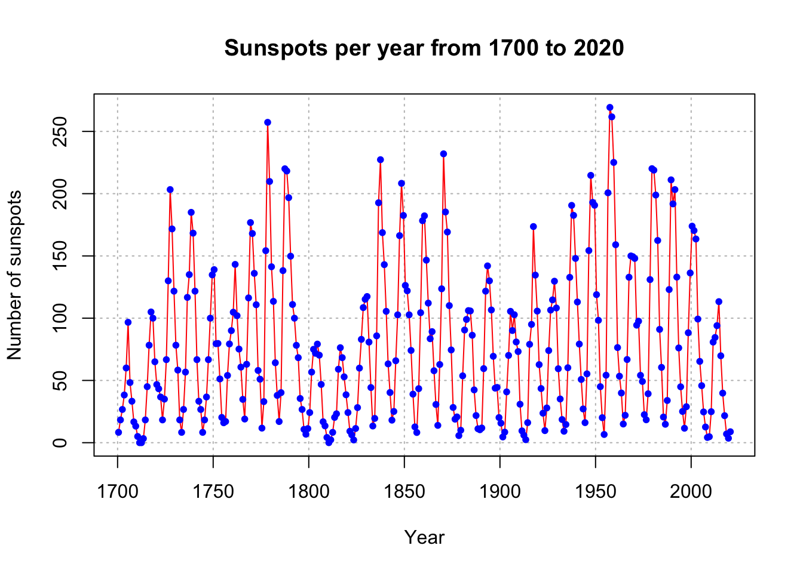
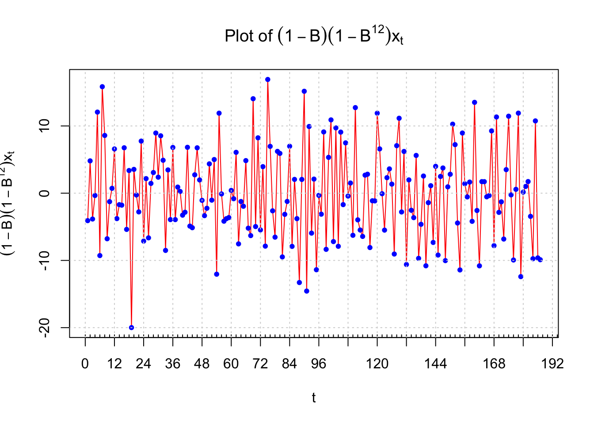

# SARIMA Models

## Introduction and Simulated Example

Time series data often has a pattern which repeats every s time periods. For example, monthly data may have s = 12.  

Seasonal ARIMA (SARIMA) models can be found using the same techniques as discussed previously. A model that only has seasonal components is written as   

$$\Phi(B^s)(1-B^s)^Dx_t=\Theta(B^s)w_t$$

where $w_t \sim ind.(0, \sigma_w^2)$ and $\Phi(B^s)=1-\Phi_1B^s-\Phi_2B^{2s}-...-\Phi_PB^{Ps}, \Theta(B^s)=1+\Theta_1B^s+\Theta_2B^{2s}+...+\Theta_QB^{Qs}$

Notice how s is used above! If s = 1, we have the “usual” non-seasonal model. Also, the “Q” here is not for the Ljung-Box-Pierce test!

The seasonal differencing operator $(1-B^s)^D$ means that for D = 1,$(1-B^s)^1x_t=x_t-x_{t-s}$.

In a purely seasonal ARIMA model (no non-seasonal components), the ACF and PACF have similar forms as for the previous non-seasonal ARIMA models. The difference is now only lags h = s, 2s, 3s, … are examined. The remainder of the lags have autocorrelations and partial autocorrelations equal to 0. Below is a table summarizing the results. 

||AR(P)s|MA(Q)s|ARMA(P,Q)s|
|---|---|---|----|
|ACF|Tails off to 0 at lags ks for k=1,2,…|Cuts off to 0 after lag Qs|Tails off to 0 after lag Qs|
|PACF|Cuts off to 0 after lag Ps|Tails off to 0 at lags ks for k=1,2,…|Tails off to 0 after lag Ps|

The ks term is multiple of s.

For example, 

|Model|ACF|PACF|
|---|---|---|
|Seasonal AR(1): $(1-\Phi_1B^s)x_t=w_t$|$\rho(sh)=\Phi_1^h$|$\phi_{sh,sh}=\begin{cases} \Phi_1 & h=1 \\ 0 & h \ge 2 \end{cases}$|


Nonseasonal patterns can be present with seasonal patterns! The ARIMA(p,d,q)x(P,D,Q)$_s$ model is

$$\Phi(B^s)\phi(B)(1-B^s)^D(1-B)^dx_t=\Theta(B^s)\theta(B)w_t$$

where $w_t \sim ind.(0, \sigma_w^2)$

The ACF and PACF plots are combinations of the ACF and PACFs from both the seasonal and non-seasonal parts of the model. This can make examining ACF and PACF plots (for determining p, q, P, and Q) quite complicated! Typically, this is the order one proceeds in when trying to determine a SARIMA model: 

1. Investigate any nonstationarity problems and try to solve them. For example, nonstationarity in the mean would appear as (s = 4): 


2. Determine P and Q; one may need to examine residual ACF and PACF plots in an iterative manner to choose good values. 

3. Investigate residual ACF and PACF plots to determine p and q; again, plots for multiple models may need to be examined in an iterative manner.  

Seasonal models can become even more complicated. 

$$\prod^{M}_{j=1}\phi_j(B^{s_j})\prod_{i=1}^{K}(1-B^{s_i})^{D_i}x_t=\prod_{k=1}^{R}\theta_k(B^{s_k})w_t$$
where $\phi_j(B^{s_j})=(1-\phi_{j,1}B^{s_j}-...-\phi_{j,p_j}B^{s_jp_j}), \theta_k(B^{s_k})=(1+\theta_{k,1}B^{s_k}+...+\theta_{k,q_k}B^{s_kq_k})$

Thus, the above representation can incorporate seasonality in more than one way. The $\Phi$ and $\Theta$ notation is not used so that a more general representation of the model can be given.  

Below are a few examples where SARIMA models would be appropriate.

:::{.example}

**Sunspots (sunspots.R)**


```r
sunspots <- read.table(file = "SN_y_tot_V2.0.csv", sep = ";",
  col.names = c("Mid.year", "Mean.total", "Mean.SD.total", "Numb.obs.used", "Definitive"))
```


```r
plot(y = sunspots$Mean.total, x = sunspots$Mid.year, ylab = "Number of sunspots", xlab = "Year", type = "l", col = "red",
     main = "Sunspots per year from 1700 to 2020",
     panel.first = grid(col = "gray", lty = "dotted"))
points(y = sunspots$Mean.total, x = sunspots$Mid.year, pch = 20, col = "blue")
```




There are approximately a 10-12 year cycle between peaks (highs) and valleys (lows).  


s $\approx$ 10-12


:::


:::{.example}

**OSU enrollment data (osu_enroll.R)**


```r
osu.enroll <- read.csv(file = "OSU_enroll.csv", stringsAsFactors = TRUE)


x <- osu.enroll$Enrollment
```


```r
plot(x = x, ylab = "OSU Enrollment", xlab = "t (time)", type = "l", col = "red",
    main = "OSU enrollment data", panel.first = grid(col = "gray", lty = "dotted"))
  points(x = x, pch = 20, col = "blue")
```


```r
#More complicated plot
fall <- osu.enroll[osu.enroll$Semester == "Fall",]
spring <- osu.enroll[osu.enroll$Semester == "Spring",]
summer <- osu.enroll[osu.enroll$Semester == "Summer",]

plot(y = fall$Enrollment, x = fall$t,
    ylab = "OSU Enrollment", xlab = "t (time)", 
    col = "blue", 
    main = "OSU Enrollment from Fall 1989 to Fall 2002", 
    panel.first = grid(col = "gray", lty = "dotted"), 
    pch = 1, type = "o", ylim = c(0,max(osu.enroll$Enrollment)))

lines(y = spring$Enrollment, x = spring$t, col = "red", 
    type = "o", pch = 2)

lines(y = summer$Enrollment, x = summer$t, col = 
    "darkgreen", type = "o", pch = 3)
    
legend(x="center", legend= c("Fall","Spring","Summer"), pch=c(1,2,3), lty=c(1,1,1), col=c("blue","red","darkgreen"), bty="n")
```


s=3

:::

Notes: 

- Large estimated autocorrelations are often present surrounding the seasonal lags.  
- Strong seasonal variation often causes large estimated autocorrelations at fractional multiples (1/2, 1/3, etc.) of the seasonal lags.  

:::{.example}

**ARIMA(0,1,1)x(0,1,1)$_{12}$ (sarima_011_011_12_sim.R)**

Suppose I want to simulate n = 200 observations from the above process with  $\sigma_w^2= 25, \mu = 0, \theta_1 = -0.4,$ and 
$\Theta_1 = -0.6.$

The process can be written so that only $x_t$ is on the left side.   

$$(1-B)(1-B^{12})x_t=(1+\theta_1B)(1+\Theta_1B^{12})w_t\\
\implies (1-B)(x_t-x_{t-12})=(1+\theta_1B)(w_t+\Theta_1w_{t-12})\\
\implies x_t-x_{t-12}-x_{t-1}+x_{t-13}=w_t+\Theta_1w_{t-12}+\theta_1w_{t-1}+\theta_1\Theta_1w_{t-13}\\
\implies x_t=x_{t-1}+x_{t-12}-x_{t-13}+w_t+\theta_1w_{t-1}+\Theta_1w_{t-12}+\theta_1\Theta_1w_{t-13}$$

Using `ARMAacf()`, we can see what the ACF and PACF is for model with **d = 0, D = 0**, q = 1, and Q = 1. Because the function does not have a direct way to input the seasonal portion, we need to multiply out the MA operators, $(1 - 0.4B)(1 - 0.6B^{12}) = 1 - 0.4B - 0.6B^{12} + 0.24B^{13}$ and use this form in the `ma` argument of `ARMAacf()`. 


```r
par(mfrow = c(1,2))
# Notice the use of rep()
plot(y = ARMAacf(ma = c(-0.4, rep(x = 0, times = 10), 
    -0.6, 0.24), lag.max = 50, pacf = FALSE), x = 0:50, 
    type = "h", ylim = c(-1,1), xlab = "h", ylab = 
    expression(rho(h)), main = "True ACF for 
    ARIMA(1,0,1)x(0,0,1)_12")
abline(h = 0)

plot(x = ARMAacf(ma = c(-0.4, rep(x = 0, times = 10), 
    -0.6, 0.24), lag.max = 50, pacf = TRUE), type = 
    "h", ylim = c(-1,1), xlab = "h", ylab = 
    expression(phi1[hh]),main = "True PACF for 
    ARIMA(1,0,1)x(0,0,1)_12")
abline(h = 0)
```


As we mentioned earlier, large estimated autocorrelations (see lag 11 and 13) are often present surrounding the seasonal lags (which is lag s=12 here) (i.e. 在seasonal lag 附近的ACF也會比較高). This occurs b/c in the above we can write the model in this way $(1 - 0.4B)(1 - 0.6B^{12}) = 1 - 0.4B - 0.6B^{12} + 0.24B^{13}$.

In fact, this is also true for the PACF, you can see large estimated PACF around lag 12 and its multiple 24, 36, 48,...
(check h=10, 11, 22, 23, 34, 35,...)

For MA(Q=1), we expect the PACF tails off to 0 at lags ks for k=1,2,…, here s=12. 

Also notice that for lag h=0~10, you can see them as non-seasonal components.


To simulate data from the model, `arima.sim()` can be used; however, not in as easy a way as one would expect.  Below are a few notes:


- Multiply out the AR and MA operators and incorporate these into one `list()` statement in `arima.sim().`  
- Program the model into R and use the `for()` function to loop over its components in a similar manner to what we did for the AR(1) example. 
- Use a user-written package. The `astsa` package includes the `sarima.sim()` function for this purpose. An example is given at the end of the program.  
 
I simulated observations from the model in the past and put them into a comma delimited file. I am going to use this data for the rest of the example. An additional **24 additional observations were simulated at the end of the t = 1, …, 200 series so that forecasted values can be compared to the true future values.** Below is the code needed to read and plot the data.


```r
sarima.data <- read.csv(file = "sarima011.011.12.csv") 
head(sarima.data)
```

```
##           x time
## 1 -167.6940    1
## 2 -171.0745    2
## 3 -168.8319    3
## 4 -172.4671    4
## 5 -172.4534    5
## 6 -191.5866    6
```

```r
x <- sarima.data$x[1:200]
```


```r
#Plot of the data
plot(x = x, ylab = expression(x[t]), xlab = "t", type 
    = "l", col = "red", main = "Data simulated from 
    ARIMA(0,1,1)x(0,1,1)_12", panel.first = grid(col = 
    "gray", lty = "dotted"))
points(x = x, pch = 20, col = "blue")
```


I also constructed another plot of the data using the gridlines to determine the seasonal behavior (looks like s = 12). 


```r
#Put gridlines at every 12th time point on the x-axis

# The xaxt = "n" option prevents the x-axis tick marks 
# from being drawn 

plot(x = x, ylab = expression(x[t]), xlab = "t", type = 
    "l", col = "red", xaxt = "n", main =  
    "Data simulated from ARIMA(0,1,1)x(0,1,1)_12")
points(x = x, pch = 20, col = "blue")

#x-axis 
# Major and minor tick marks - see intro. to R examples
axis(side = 1, at = seq(from = 0, to = 192, by = 12)) 
axis(side = 1, at = seq(from = 0, to = 200, by = 2), 
    tck = 0.01, labels = FALSE) 
abline(v = seq(from = 0, to = 192, by = 12), lty = 
      "dotted", col = "lightgray")

#y-axis 
abline(h = seq(from = -350, to = -150, by = 50), lty = 
    "dotted", col = "lightgray")
```


Next are the plots of the estimated ACF and PACF. Notice the `lag.max` command is used to increase the number of lags shown on the plot. This is helpful to see a seasonal pattern. Obviously, the data is nonstationary in the mean.  


```r
#ACF and PACF of x_t
par(mfcol = c(1,2))
acf(x = x, type = "correlation", lag.max = 50, ylim = 
    c(-1,1), main = expression(paste("Estimated ACF plot 
    for ", x[t])))
pacf(x = x, lag.max = 50, ylim = c(-1,1), xlab = "h", 
    main = expression(paste("Estimated PACF plot for ", 
    x[t])))
```


There are two ways to take care of the nonstationarity:

1.	Find the first differences: (1-B)
2.	Determine if seasonal differences are needed: $(1-B^s)$

The ACF plot is showing a “slightly higher” value at every 12th autocorrelation. This possibly shows that $(1-B^{12})$ is needed. In addition, the ACF at all lags is going slowly to 0 indicating that (1-B) is needed. I decided to look at this type of differences first.  


```r
#ACF and PACF of (1-B)*x_t
par(mfrow = c(1,2))
acf(x = diff(x = x, lag = 1, differences = 1), type = 
    "correlation", lag.max = 50, xlim = c(1,50), ylim = 
    c(-1,1), main = expression(paste("Est. ACF for ", (1-
    B)*x[t], " data")))
pacf(x = diff(x = x, lag = 1, differences = 1), lag.max 
    = 50, xlim = c(1,50), ylim = c(-1,1), xlab = "h", 
    main = expression(paste("Est. PACF for ", (1-B)*x[t], 
    " data")))
```


The ACF plot definitely shows a 12 lag pattern of very high autocorrelations. This suggests that $(1-B^{12})$ should also be examined. 


```r
#ACF and PACF of (1-B^12)*x_t
  par(mfrow = c(1,2))
  acf(x = diff(x = x, lag = 12, differences = 1), type = "correlation", lag.max = 50, xlim = c(1,50), 
      ylim = c(-1,1), main = expression(paste("Est. ACF for ", (1-B^12)*x[t], " data")))
  pacf(x = diff(x = x, lag = 12, differences = 1), lag.max = 50, xlim = c(1,50), ylim = c(-1,1), xlab = "h", 
       main = expression(paste("Est. PACF for ", (1-B^12)*x[t], " data")))
```


```r
  par(mfrow = c(1,1))
```


Below is the code used to examine the results of $(1-B^{12})(1-B)x_t$. Notice how the `diff()` function is used.


`x2 <- diff(x = diff(x = x, lag = 12, differences = 1), lag = 1, differences = 1)`

The diff inside deal with seasonal part: x_t - x_{t-12} and the diff outside deal with non-seasonal part, which one you want to deal with first doesn't matter.


```r
#ACF and PACF of (1-B)(1-B^12)*x_t
par(mfrow = c(1,2))

x2 <- diff(x = diff(x = x, lag = 12, differences = 1), 
    lag = 1, differences = 1)
acf(x = x2, type = "correlation", lag.max = 50, xlim = 
    c(1,50), ylim = c(-1,1), main = expression(paste( 
    "Est. ACF for ", (1-B)*(1-B^12)*x[t], " data")), 
    panel.first = grid(col = "gray", lty = "dotted"))
pacf(x = x2, lag.max = 50, xlim = c(1,50), ylim = 
    c(-1,1), xlab = "h", main = expression(paste("Est. 
    PACF for ", (1-B)*(1-B^12)*x[t], " data")), 
    panel.first = grid(col = "gray", lty = "dotted"))
```


In the Est.ACF plot, look at lag:0~10, these are for the non-seasonal part, same for the PACF plot. As for lag 12, large estimated ACF indicate the seasonal part, and we did not see large estimated ACF at multiple of 12 b/c we've done differencing. Also, large estimated ACF was found at lag 11, this is nothing special as we mentioned before, we usually have large ACF surrounding the seasonality lag.

Same thing occurs in PACF plot large estimated PACF occur surrounding the multiple of the seasonality lag, nothing to worry about.


```r
#Plot of the differenced data  
plot(x = x2, ylab = expression((1-B)*(1-B^12)*x[t]), 
    xlab = "t", type = "l", col = "red", xaxt = "n", 
    main =  expression(paste("Plot of ", (1-B)*(1-
    B^12)*x[t])))
points(x = x2, pch = 20, col = "blue")
axis(side = 1, at = seq(from = 0, to = 192, by = 12)) 
axis(side = 1, at = seq(from = 0, to = 200, by = 2), 
    tck = 0.01, labels = FALSE) 
abline(v = seq(from = 0, to = 192, by = 12), lty = 
    "dotted", col = "lightgray")
abline(h = seq(from = -20, to = 10, by = 10), lty = 
    "dotted", col = "lightgray")
```



There is no longer a nonstationary behavior in the resulting time series data. The PACF plot shows definite significant values at lag 1, 12, and 13. A few other partial autocorrelations may be significant also. The ACF has significant autocorrelations at lag 1 and 12. This indicates that an ARIMA(0,1,1)x(0,1,1)$_{12}$ should be examined. Also, this assumes the PACF behavior is tailing off to 0 for lag 12, 24, … and lag 1, 2, … . Note that there may be justification for other models with P = 1 or 2 and p = 1. I will examine an ARIMA(0,1,**0**)x(0,1,1)$_{12}$ model and determine from the residuals if any changes need to be made. The q = 1 is not used because I would like to get the seasonal part of the model figured out first. Below is the code and output. Notice the syntax used with the `arima()` function to fit the SARIMA model.  


```r
#Fit model to data
mod.fit.010.011 <- arima(x = x, order = c(0, 1, 0), 
    seasonal = list(order = c(0, 1, 1), period = 12))
mod.fit.010.011
```

```
## 
## Call:
## arima(x = x, order = c(0, 1, 0), seasonal = list(order = c(0, 1, 1), period = 12))
## 
## Coefficients:
##          sma1
##       -0.6447
## s.e.   0.0605
## 
## sigma^2 estimated as 32.46:  log likelihood = -593.95,  aic = 1191.89
```

- $\hat \Theta_1=-0.6447$

- $\sqrt{\hat Var(\hat \Theta_1)}=0.0605$

- $\hat \sigma_w^2=32.46$


```r
source("examine.mod.R")
#Need to run function in examine.mod.R file first
examine.mod(mod.fit.obj = mod.fit.010.011, 
    mod.name = "ARIMA(0,1,0)x(0,1,1)_12", max.lag = 50)
```


```
## $z
##      sma1 
## -10.65188 
## 
## $p.value
## sma1 
##    0
```

Notice in the ACF of Residuals plot, we see large ACF at lag 1, indicating q=1 may be needed. Also note that the p-values for Kjung-Boc statistic are very small, this is no good.You should also notice the estimated PACF are tailing off after lag 1. 

The residual ACF and PACF show no more signs of a seasonal pattern! It is too bad that R does not allow one to automatically use a larger number of lags on the ACF plot (see the R help for how the number of lags displayed is determined). The $\Theta_1$ is significantly different from 0. The ACF has a significant autocorrelation at lag 1 and the PACF appears to be tailing off to 0. Therefore, the model ARIMA(0,1,1)x(0,1,1)$_{12}$ will be tried. Below is the code and output.  


```r
#ARIMA(0,1,1)x(0,1,1)_12
mod.fit.011.011 <- arima(x = x, order = c(0, 1, 1), 
      seasonal = list(order = c(0, 1, 1), period = 12))
mod.fit.011.011
```

```
## 
## Call:
## arima(x = x, order = c(0, 1, 1), seasonal = list(order = c(0, 1, 1), period = 12))
## 
## Coefficients:
##           ma1     sma1
##       -0.4113  -0.6347
## s.e.   0.0680   0.0617
## 
## sigma^2 estimated as 28.19:  log likelihood = -580.72,  aic = 1167.44
```

- $\hat \theta_1=-0.4113$

- $\hat \Theta_1=-0.6347$

- $\hat \sigma_w^2=28.19$


```r
examine.mod(mod.fit.obj = mod.fit.011.011, mod.name = 
    "ARIMA(0,1,1)x(0,1,1)_12", max.lag = 50)
```


```
## $z
##        ma1       sma1 
##  -6.051257 -10.285054 
## 
## $p.value
##        ma1       sma1 
## 1.4372e-09 0.0000e+00
```


The residual ACF and PACF appear to be similar to the same plots resulting from a white noise process. The $\Theta_1$ and $\theta_1$ are significantly different from 0. There are no extreme standardized residuals. The residual histogram and Q-Q plot maybe show some non-normality on the tails of the distribution, but it is not too bad. Remember the data was simulated using a normal distribution so this is a good example of something to not be concerned about! The histogram may also include too many classes for the x-axis. Below is a plot of the same residuals now with less classes (see program for code). 


```r
hist(x = mod.fit.011.011$residuals, main = "Histogram of residuals", xlab = "Residuals", freq = FALSE, col = NA, breaks = 6)
```


```r
  hist(x = mod.fit.011.011$residuals, main = "Histogram of residuals",
    xlab = "Residuals", freq = FALSE, col = NA, breaks = seq(from = -15, to = 15, by = 5))
  curve(expr = dnorm(x, mean = mean(mod.fit.011.011$residuals),
    sd = sd(mod.fit.011.011$residuals)), col = "red", add = TRUE)
```


The Ljung-Box-Pierce test indicates there is not sufficient evidence of non-zero autocorrelations.  

Therefore, my final estimated model is 

$$(1-B^{12})(1-B)x_t=(1-0.6347B^{12})(1-0.4113B)w_t$$ 
where $\hat \sigma_w^2=28.19$

Compare how close these parameter estimates are to what was used to generate the data!

If I did not know what the model should have been at the beginning, it would have been very reasonable to investigate other models indicated previously. If more than one model passed all of the diagnostic tests, I would have used the AIC to help pick the best model.  

Forecasts are found for 24 time periods into the future. Notice this corresponds to just 2 “seasons” into the future. 


```r
#Forecasts 24 time periods into the future
fore.mod <- predict(object = mod.fit.011.011, n.ahead = 
    24, se.fit = TRUE) 
fore.mod
```

```
## $pred
## Time Series:
## Start = 201 
## End = 224 
## Frequency = 1 
##  [1] -317.5528 -330.8742 -352.8390 -344.9029 -332.8707 -348.5246 -348.1134
##  [8] -352.1134 -351.7119 -350.6458 -352.5155 -346.0474 -328.9166 -342.2380
## [15] -364.2027 -356.2667 -344.2345 -359.8884 -359.4772 -363.4771 -363.0757
## [22] -362.0096 -363.8793 -357.4111
## 
## $se
## Time Series:
## Start = 201 
## End = 224 
## Frequency = 1 
##  [1]  5.309460  6.161149  6.908628  7.582779  8.201703  8.777090  9.317011
##  [8]  9.827313 10.312394 10.775661 11.219815 11.647044 12.700809 13.398572
## [15] 14.061753 14.695035 15.302131 15.886044 16.449241 16.993784 17.521412
## [22] 18.033608 18.531654 19.016660
```

- $\tilde x^{200}_{201}=-317.5528$

- $\tilde x^{200}_{224}=-357.4111$

- $\sqrt{\hat Var(x_{201}-\tilde x^{200}_{201})}=5.309460$


```r
pred.mod <- x - mod.fit.011.011$residuals
```


```r
#Calculate 95% C.I.s 
low <- fore.mod$pred - qnorm(p = 0.975, mean = 0, sd = 1)*fore.mod$se
up <- fore.mod$pred + qnorm(p = 0.975, mean = 0, sd = 1)*fore.mod$se
data.frame(low, up)
```

```
##          low        up
## 1  -327.9592 -307.1465
## 2  -342.9499 -318.7986
## 3  -366.3796 -339.2983
## 4  -359.7649 -330.0410
## 5  -348.9458 -316.7957
## 6  -365.7274 -331.3218
## 7  -366.3744 -329.8524
## 8  -371.3745 -332.8522
## 9  -371.9239 -331.5000
## 10 -371.7657 -329.5259
## 11 -374.5060 -330.5251
## 12 -368.8751 -323.2196
## 13 -353.8097 -304.0235
## 14 -368.4987 -315.9773
## 15 -391.7633 -336.6422
## 16 -385.0685 -327.4650
## 17 -374.2261 -314.2429
## 18 -391.0245 -328.7523
## 19 -391.7171 -327.2373
## 20 -396.7843 -330.1699
## 21 -397.4171 -328.7344
## 22 -397.3548 -326.6643
## 23 -400.2007 -327.5580
## 24 -394.6831 -320.1392
```

$-327.9593<x_{201}<-307.1465$


```r
#When I originally simulated the data, 224 observations 
#were actually simulated. I did this so that I could 
#examine how well the confidence intervals captured 
#the true future values.
x.extra <- sarima.data$x[201:224]
```


```r
plot(x = x, ylab = expression(x[t]), xlab = "t", type = 
    "o", col = "red", xaxt = "n", ylim = c(-400, -150), 
    pch = 20, xlim = c(0, 224), main =  "Forecast plot")
axis(side = 1, at = seq(from = 0, to = 224, by = 12), 
    las = 2) #las makes the labels vertical
axis(side = 1, at = seq(from = 0, to = 224, by = 2), 
    tck = 0.01, labels = FALSE) 
abline(v = seq(from = 0, to = 224, by = 12), lty = 
    "dotted", col = "lightgray")
abline(h = seq(from = -400, to = -150, by = 50), lty = 
    "dotted", col = "lightgray")

#Predicted values for t = 1, ..., 200 and forecasts for 
#  t = 201, ..., 224
lines(x = c(pred.mod, fore.mod$pred), lwd = 1, col = 
    "black", type = "o", pch = 17) 


#Forecasts and C.I.s
lines(y = low, x = 201:224, lwd = 1, col = "darkgreen", 
    lty = "dashed") 
lines(y = up, x = 201:224, lwd = 1, col = "darkgreen", 
    lty = "dashed") 


#Actual future values
lines(y = x.extra, x = 201:224, lwd = 1, col = "blue", 
    lty = "solid", type = "o", pch = 20) 

#Legend
legend("bottomleft", legend = c("Observed", "Forecast", 
    "95% C.I.", "Actual future values"), lty = c("solid", 
    "solid", "dashed", "solid"), col = c("red", "black", 
    "darkgreen", "blue"), pch = c(20, 17, NA, 20), bty = 
    "n")
```


This is hard to see so I created another plot that zoomed in on the right side. Please see the program for the code.  


```r
#Zoom in
   
#Plot of forecasts, C.I.s, and true future values.
  #dev.new(width = 8, height = 6, pointsize = 10)
  
plot(x = x, ylab = expression(x[t]), xlab = "t", type = "o", col = "red", xaxt = "n", pch = 20, ylim = c(-400, -250),
       xlim = c(190, 224), main =  "Forecast plot")

#These are the same axis() and abline() functions as done in the previous plot
#  R will still line up everything correctly with what is given in the current plot()
  axis(side = 1, at = seq(from = 0, to = 224, by = 12)) 
  axis(side = 1, at = seq(from = 0, to = 224, by = 2), tck = 0.01, labels = FALSE) 
  abline(v = seq(from = 0, to = 224, by = 12), lty = "dotted", col = "lightgray")
  abline(h = seq(from = -400, to = -150, by = 50), lty = "dotted", col = "lightgray")
   
#Predicted values for t = 1, ..., 200 
# and forecasts for t = 201, ..., 224
  lines(x = c(pred.mod, fore.mod$pred), lwd = 1, col = "black", type = "o", pch = 17) 
  
#Forecasts and C.I.s
  lines(y = low, x = 201:224, lwd = 1, col = "darkgreen", lty = "dashed") 
  lines(y = up, x = 201:224, lwd = 1, col = "darkgreen", lty = "dashed") 
  
#Actual future values
  lines(y = x.extra, x = 201:224, lwd = 1, col = "blue", lty = "solid", type = "o", pch = 20) 
  
#Legend
  legend("bottomleft", legend = c("Observed", "Forecast", "95% C.I.", "Actual future values"), 
         lty = c("solid", "solid", "dashed", "solid"),
         col = c("red", "black", "darkgreen", "blue"), pch = c(20, 17, NA, 20), bty = "n")
```


Notice that all of the actual values are within the 95% C.I.s!


What if $\delta$ was estimated? The term ends up being highly non-significant as shown in the output below.  


```r
mod.fit.011.011.delta <- arima(x = x, order = c(0, 1, 1), 
   seasonal = list(order = c(0, 1, 1), period = 12), 
   xreg = 1:length(x))
mod.fit.011.011.delta 
```

```
## 
## Call:
## arima(x = x, order = c(0, 1, 1), seasonal = list(order = c(0, 1, 1), period = 12), 
##     xreg = 1:length(x))
## 
## Coefficients:
```

```
## Warning in sqrt(diag(x$var.coef)): NaNs produced
```

```
##           ma1     sma1  1:length(x)
##       -0.4113  -0.6347      -2.1554
## s.e.   0.0680   0.0617          NaN
## 
## sigma^2 estimated as 28.19:  log likelihood = -580.72,  aic = 1169.44
```

$\hat \delta=-2.1554$


```r
examine.mod(mod.fit.obj = mod.fit.011.011.delta, 
    mod.name = "ARIMA(0,1,1)x(0,1,1)_12 with delta", 
    max.lag = 50)
```

```
## Warning in sqrt(diag(mod.fit.obj$var.coef)): NaNs produced
```


```
## $z
##         ma1        sma1 1:length(x) 
##   -6.051352  -10.286708         NaN 
## 
## $p.value
##          ma1         sma1  1:length(x) 
## 1.436353e-09 0.000000e+00          NaN
```

The diagnostic plots are excluded from the notes.  

:::

Below we see how we can use the package `astsa` to simulate data.


```r
# Example way to simulate data from this model

library(package = astsa)
set.seed(8239)
  x <- sarima.sim(d = 1, ma = -0.4, D = 1, sma = -0.6, S = 12, n = 200, sd = 5)
  head(x)
```

```
## [1] 57.07862 58.87815 63.76458 57.06578 72.82324 75.33991
```

```r
  plot(x = x, ylab = expression(x[t]), xlab = "t", type = "l", col = "red",
    main =  "Data simulated from ARIMA(0,1,1)x(0,1,1)_12",
    panel.first=grid(col = "gray", lty = "dotted"))
  points(x = x, pch = 20, col = "blue")
```


```r
#ACF and PACF of x_t
  #dev.new(width = 8, height = 6, pointsize = 10)
par(mfcol = c(1,2))
  acf(x = x, type = "correlation", lag.max = 50, ylim = c(-1,1), main = expression(paste("Estimated ACF plot for ", x[t])))
  pacf(x = x, lag.max = 50, ylim = c(-1,1), xlab = "h", main = expression(paste("Estimated PACF plot for ", x[t])))
```


```r
 # Estimates are close to parameters
  arima(x = x, order = c(0, 1, 1), seasonal = list(order = c(0, 1, 1), period = 12))
```

```
## 
## Call:
## arima(x = x, order = c(0, 1, 1), seasonal = list(order = c(0, 1, 1), period = 12))
## 
## Coefficients:
##           ma1     sma1
##       -0.4209  -0.4958
## s.e.   0.0607   0.0629
## 
## sigma^2 estimated as 23.62:  log likelihood = -562.8,  aic = 1131.59
```


```r
# Example showing how NOT to simulate SARIMA data

  #Code simulates some observations, but what model??? 
  set.seed(1890)
  x <- arima.sim(model = list(list(order = c(0,1,1), ma = -0.4), list(order = c(0,1,1), ma = -0.6, period = 12)),
    n = 200, rand.gen = rnorm, sd = 5)
  x[1:10] #Notice that x_1 is missing
```

```
##  [1]  3.6785060 -7.6322208 -0.6449263 -4.9990844  0.7669400  5.8649723
##  [7]  1.6828721  0.6659346 -3.1937851  0.6594206
```


```r
#Plot of the data
  #dev.new(width = 8, height = 6, pointsize = 10)
  par(mfrow = c(1,1))
  plot(x = x, ylab = expression(x[t]), xlab = "t", type = "l", col = c("red"),  
        main =  "Data simulated from ARIMA(0,1,1)x(0,1,1)_12",
        panel.first=grid(col = "gray", lty = "dotted"))
  points(x = x, pch = 20, col = "blue")
```


```r
#Fit model to data 
# notice how far off the estimates are from the parameters.  
  arima(x = x, order = c(0, 1, 1), seasonal = list(order = c(0, 1, 1), period = 12))
```

```
## 
## Call:
## arima(x = x, order = c(0, 1, 1), seasonal = list(order = c(0, 1, 1), period = 12))
## 
## Coefficients:
##           ma1     sma1
##       -1.0000  -1.0000
## s.e.   0.0658   0.0696
## 
## sigma^2 estimated as 22.26:  log likelihood = -576.56,  aic = 1159.12
```


```r
arima(x = x, order = c(0, 1, 1))
```

```
## 
## Call:
## arima(x = x, order = c(0, 1, 1))
## 
## Coefficients:
##           ma1
##       -1.0000
## s.e.   0.0155
## 
## sigma^2 estimated as 22.1:  log likelihood = -593.01,  aic = 1190.01
```


## OSU Example

:::{.example}

**OSU enrollment data(osu_enroll_MB.R)**

The Office of Planning, Budget, and Institutional Research (OPBIR) makes fall semester enrollment forecasts in their annual Student Profile report. At the beginning of the course, we examined an O’Colly article which discussed these forecasts. In particular, the forecast for fall 2000 was 743 students too high resulting in a $1.8 million tuition shortfall. According to an official OPBIR document, forecasts were made using the following method: 

> New freshmen projections are based on an expected market share of projected Oklahoma ACT test takers.  On-campus sophomore, junior and senior projections are based on cohort survival rates using an average of the previous three years. OSU-Tulsa undergraduates are projected to increase approximately 5% per year.


According to OPBIR, the enrollment data was collected as close to the final Drop and Add Day as possible.   

For this analysis, I am going to use data up to the spring 2002 semester only to simulate what would be available for wanting to forecast fall 2002. Below are the estimated ACF and PACF plots of the data.  


```r
osu.enroll <- read.csv(file = "OSU_enroll.csv", stringsAsFactors = TRUE)
head(osu.enroll)
```

```
##   t Semester Year Enrollment      date
## 1 1     Fall 1989      20110 8/31/1989
## 2 2   Spring 1990      19128  2/1/1990
## 3 3   Summer 1990       7553  6/1/1990
## 4 4     Fall 1990      19591 8/31/1990
## 5 5   Spring 1991      18361  2/1/1991
## 6 6   Summer 1991       6702  6/1/1991
```

```r
tail(osu.enroll)
```

```
##     t Semester Year Enrollment      date
## 35 35   Spring 2001      20004  2/1/2001
## 36 36   Summer 2001       7558  6/1/2001
## 37 37     Fall 2001      21872 8/31/2001
## 38 38   Spring 2002      20922  2/1/2002
## 39 39   Summer 2002       7868  6/1/2002
## 40 40     Fall 2002      22992 8/31/2002
```


```r
# Suppose it was early spring 2002 and you wanted to 
# forecast fall 2002 so use data only up to spring 2002
x <- osu.enroll$Enrollment[1:38]  
```


```r
#dev.new(width = 8, height = 6, pointsize = 10) 
#width = 6 is default so this makes it wider
  plot(x = x, ylab = "OSU Enrollment", xlab = "t (time)", type = "l", col = "red",
    main = "OSU enrollment data", panel.first = grid(col = "gray", lty = "dotted"))
  points(x = x, pch = 20, col = "blue")
```


```r
#ACF and PACF of x_t
par(mfcol = c(1,2))
acf(x = x, type = "correlation", lag.max = 20, ylim = 
    c(-1,1), main = expression(paste("Estimated ACF plot 
    for ", x[t])), xlim = c(1,20))
pacf(x = x, lag.max = 20, ylim = c(-1,1), xlab = "h", 
    main = expression(paste("Estimated PACF plot for ", 
    x[t])))
```


The autocorrelations are very slowly going to 0 for lag 3, 6, 9, …  . Therefore, first differences should be examined for s = 3.  

Suppose instead an ARIMA(0,0,0)x(1,0,0)$_3$ model was fit to the data. This may happen if the ACF plot was interpreted as tailing off to 0 and noticing the significant lag 3 partial autocorrelation.


```r
#mod.fit.000.100 <- arima(x = x, order = c(0, 0, 0), seasonal = list(order = c(1, 0, 0), period = 3))
#mod.fit.000.100
```

R gives an error message saying the model cannot be fit due to non-stationarity. For s = 3, first differences, $(1-B^3)$, could be interpreted as having a 1 coefficient on $B^3$.


Below are the ACF and PACF plots after taking the first differences with s = 3.  


```r
#ACF and PACF of (1-B^3)*x_t
acf(x = diff(x = x, lag = 3, differences = 1), type = 
    "correlation", lag.max = 20, ylim = c(-1,1), main = 
    expression(paste("Est. ACF for ", (1-B^3)*x[t], " 
    data")), xlim = c(1,20))
```


```r
pacf(x = diff(x = x, lag = 3, differences = 1), lag.max 
    = 20, ylim = c(-1,1), xlab = "h", main =
    expression(paste("Est. PACF for ", (1-B^3)*x[t],  
    " data")))
```


For the non-seasonal part, the ACF is tailing off to 0 and the PACF has a significant value at lag = 1. For the seasonal part, it looks like there may be a significant autocorrelation at lag 9. Possibly due to the small season length (s = 3), it may be hiding other significant values.  Because I am not for sure, I decided to add an AR(1) term to the model for the non-seasonal part. Below is part of the output and code. 


```r
mod.fit.100.010 <- arima(x = x, order = c(1, 0, 0), 
    seasonal = list(order = c(0, 1, 0), period = 3))
mod.fit.100.010
```

```
## 
## Call:
## arima(x = x, order = c(1, 0, 0), seasonal = list(order = c(0, 1, 0), period = 3))
## 
## Coefficients:
##          ar1
##       0.6989
## s.e.  0.1278
## 
## sigma^2 estimated as 130905:  log likelihood = -256.19,  aic = 516.37
```


```r
#Need to run function in examine.mod.R file first
examine.mod(mod.fit.obj = mod.fit.100.010, mod.name = 
    "ARIMA(1,0,0)x(0,1,0)_3", max.lag = 20)
```


```
## $z
##      ar1 
## 5.468632 
## 
## $p.value
##          ar1 
## 4.535231e-08
```

Notes: 

- Does the model make sense for this problem? Yes! For students in Spring, most of those same students are expected to still stay in Fall, so this one-period dependence can be captured by AR(1).
- The test of $H_0:\phi_1=0, H_a:\phi_1\ne 0$ produces a test statistic of 0.6989/0.1278 = 5.47. Therefore, $\phi_1\ne 0.$
- The residual ACF and PACF plots do not show any significantly different from 0 values.  
- The Ljung-Box-Pierce test also results in all “don’t reject Ho’s” for its test of non-zero autocorrelation.  
- There are no extreme standardized residuals.  
- There is some evidence against normality in the histogram and QQ-Plot. However, because the sample size is fairly small, I am not surprised by this and decided not to investigate transformations.  
- Because everything is o.k. with this model, one could use the final estimated model of an ARIMA(1,0,0)x(0,1,0)$_3$:

$(1-0.6989B)(1-B^3)x_t = w_t$ with $\hat \sigma_w^2=130,905$

:::


I still have some concerns about whether or not this is the best model that I could use. Below are some items that I tried first starting with just the $(1-B^3)x_t$ series.  

1. Remember seeing the marginally large autocorrelation at lag 9 for the $(1-B^3)x_t$ series? Given s = 3, I decided to investigate adding seasonal MA terms to a model. The ARIMA(1,0,0)x(0,1,1)$_3$ model results in a significant $\Theta_1$ and the residual ACF and PACF plots indicate either $\phi_1$ or $\theta_1$ should be added to the model. When $\phi_1$ is added to the model, $\Theta_1$ has a p-value of 0.11 and the AIC is 516 which is a little smaller than the 516.37 for the ARIMA(1,0,0)x(0,1,0)$_3$ model. 


```r
mod.fit <- arima(x = x, order = c(1, 0, 0), seasonal = list(order = c(0, 1, 1), period = 3))
mod.fit
```

```
## 
## Call:
## arima(x = x, order = c(1, 0, 0), seasonal = list(order = c(0, 1, 1), period = 3))
## 
## Coefficients:
##          ar1    sma1
##       0.6879  0.3193
## s.e.  0.1280  0.2024
## 
## sigma^2 estimated as 120619:  log likelihood = -255,  aic = 516
```


```r
examine.mod(mod.fit.obj = mod.fit, mod.name = "ARIMA(1,0,0)x(0,1,1)_3", max.lag = 20)
```


```
## $z
##      ar1     sma1 
## 5.374020 1.577184 
## 
## $p.value
##          ar1         sma1 
## 7.700036e-08 1.147532e-01
```

When $\theta_1$ is added, $\Theta_1$ is no longer significant (p-value = 0.25) and there are marginally significant groups of autocorrelations as found by the Ljung-Box-Pierce test.


```r
mod.fit <- arima(x = x, order = c(0, 0, 1), seasonal = list(order = c(0, 1, 1), period = 3))
mod.fit
```

```
## 
## Call:
## arima(x = x, order = c(0, 0, 1), seasonal = list(order = c(0, 1, 1), period = 3))
## 
## Coefficients:
##          ma1    sma1
##       0.6303  0.2765
## s.e.  0.1252  0.2384
## 
## sigma^2 estimated as 135028:  log likelihood = -256.84,  aic = 519.68
```

```r
examine.mod(mod.fit.obj = mod.fit, mod.name = "ARIMA(0,0,1)x(0,1,1)_3", max.lag = 20)
```


```
## $z
##      ma1     sma1 
## 5.033994 1.159878 
## 
## $p.value
##          ma1         sma1 
## 4.803635e-07 2.460984e-01
```


2. Due to the significant autocorrelation at lag 1, I decided to start with a $\theta_1$. The term is significant, but the Ljung-Box-Pierce test results in smaller p-values (some marginally significant?) than for the ARIMA(1,0,0)x(0,1,0)$_3$ model. The ARIMA(0,0,1)x(0,1,0)$_3$ model’s AIC is 519.2 which is larger than the 516.37 for the ARIMA(1,0,0)x(0,1,0)$_3$ model. 


```r
  mod.fit <- arima(x = x, order = c(0, 0, 1), seasonal = list(order = c(0, 1, 0), period = 3))
  mod.fit
```

```
## 
## Call:
## arima(x = x, order = c(0, 0, 1), seasonal = list(order = c(0, 1, 0), period = 3))
## 
## Coefficients:
##          ma1
##       0.6935
## s.e.  0.1153
## 
## sigma^2 estimated as 141961:  log likelihood = -257.6,  aic = 519.2
```


```r
  examine.mod(mod.fit.obj = mod.fit, mod.name = "ARIMA(0,0,1)x(0,1,0)_3", max.lag = 20)
```


```
## $z
##      ma1 
## 6.015392 
## 
## $p.value
##         ma1 
## 1.79452e-09
```

When both $\theta_1$ and $\phi_1$ are in the model, $\theta_1$ is no longer significant.  


```r
  mod.fit <- arima(x = x, order = c(1, 0, 1), seasonal = list(order = c(0, 1, 0), period = 3))
  mod.fit
```

```
## 
## Call:
## arima(x = x, order = c(1, 0, 1), seasonal = list(order = c(0, 1, 0), period = 3))
## 
## Coefficients:
##          ar1     ma1
##       0.5544  0.2463
## s.e.  0.3478  0.4910
## 
## sigma^2 estimated as 129731:  log likelihood = -256.04,  aic = 518.07
```

```r
  examine.mod(mod.fit.obj = mod.fit, mod.name = "ARIMA(1,0,1)x(0,1,0)_3", max.lag = 20)
```


```
## $z
##       ar1       ma1 
## 1.5940900 0.5017557 
## 
## $p.value
##       ar1       ma1 
## 0.1109159 0.6158394
```


3. When $\Phi_1$ is in the model alone, it is marginally significant (p-value = 0.086) and the residual ACF and PACF’s indicate changes need to be made to the non-seasonal part of the model. 


```r
  mod.fit <- arima(x = x, order = c(0, 0, 0), seasonal = list(order = c(1, 1, 0), period = 3))
  mod.fit
```

```
## 
## Call:
## arima(x = x, order = c(0, 0, 0), seasonal = list(order = c(1, 1, 0), period = 3))
## 
## Coefficients:
##         sar1
##       0.3198
## s.e.  0.1860
## 
## sigma^2 estimated as 219343:  log likelihood = -265.05,  aic = 534.09
```

```r
examine.mod(mod.fit.obj = mod.fit, mod.name = "ARIMA(0,0,0)x(1,1,0)_3", max.lag = 20)
```


```
## $z
##     sar1 
## 1.719011 
## 
## $p.value
##       sar1 
## 0.08561236
```


When $\phi_1$ is added, $\Phi_1$ has a p-value of 0.15 and $\phi_1$ is highly significant. The AIC is 516.35.  


```r
  mod.fit <- arima(x = x, order = c(1, 0, 0), seasonal = list(order = c(1, 1, 0), period = 3))
  mod.fit
```

```
## 
## Call:
## arima(x = x, order = c(1, 0, 0), seasonal = list(order = c(1, 1, 0), period = 3))
## 
## Coefficients:
##          ar1    sar1
##       0.6858  0.2567
## s.e.  0.1283  0.1765
## 
## sigma^2 estimated as 122345:  log likelihood = -255.17,  aic = 516.35
```


```r
examine.mod(mod.fit.obj = mod.fit, mod.name = "ARIMA(1,0,0)x(1,1,0)_3", max.lag = 20)
```


```
## $z
##      ar1     sar1 
## 5.346115 1.454712 
## 
## $p.value
##          ar1         sar1 
## 8.986215e-08 1.457490e-01
```


4. Below is a plot of $(1-B^3)x_t$:


```r
 #Plot of (1-B^3)*x_t 
  #dev.new(width = 8, height = 6, pointsize = 10)
  par(mfrow = c(1,1))
  plot(x = diff(x = x, lag = 3, differences = 1), ylab = expression((1-B^3)*x[t]), xlab = "t", type = "l", col = "red",  
        main =  expression(paste("Plot of ", (1-B^3)*x[t])), panel.first=grid(col = "gray", lty = "dotted"))
  points(x = diff(x = x, lag = 3, differences = 1), pch = 20, col = "blue")
```


This could indicate nonstationarity still exists and that differencing is needed. If one examined $(1-B)(1-B^3)x_t$, the following results


```r
 #ACF and PACF of (1-B)*(1-B^3)*x_t
  par(mfrow = c(1,2))
  x2 <- diff(x = diff(x = x, lag = 3, differences = 1), lag = 1, differences = 1)
  acf(x = x2, type = "correlation", lag.max = 20, xlim = c(1,20),
      ylim = c(-1,1), main = expression(paste("Est. ACF for ", (1-B)*(1-B^3)*x[t], " data")))
  pacf(x = x2, lag.max = 20, ylim = c(-1,1), xlab = "h", 
       main = expression(paste("Est. PACF for ", (1-B)*(1-B^3)*x[t], " data")))
```


```r
 #Plot of (1-B)*(1-B^3)*x_t 
  # dev.new(width = 8, height = 6, pointsize = 10)
  par(mfrow = c(1,1))
  plot(x = x2, xlab = "t", type = "l", col = "red", main = expression(paste("Plot of ", (1-B)*(1-B^3)*x[t])), 
      ylab = expression((1-B)*(1-B^3)*x[t]), panel.first=grid(col = "gray", lty = "dotted"))
  points(x = x2, pch = 20, col = "blue")
```


While there is no longer the small upward trend in the plot of the data over time, the estimated ACF and PACF have no significant values. There does appear to be too many negative partial autocorrelations indicating there is some dependence left in the series. Also, the Ljung-Box-Pierce test indicates some marginally significant tests. 


```r
 mod.fit <- arima(x = x, order = c(0, 1, 0), seasonal = list(order = c(0, 1, 0), period = 3))
  mod.fit
```

```
## 
## Call:
## arima(x = x, order = c(0, 1, 0), seasonal = list(order = c(0, 1, 0), period = 3))
## 
## 
## sigma^2 estimated as 150974:  log likelihood = -250.97,  aic = 503.93
```


```r
  examine.mod(mod.fit.obj = mod.fit, mod.name = "ARIMA(0,1,0)x(0,1,0)_3", max.lag = 20)
```


```
## $z
## <0 x 0 matrix>
## 
## $p.value
## numeric(0)
```


I tried a variety of ARIMA models with the data, but none produced significant AR or MA parameters. Also, I am a little concerned about doing the (1-B) difference considering the ARIMA(1,0,0)x(0,1,0)$_3$ estimates $\phi_1$ to be 0.6989.  Using the standard error, a 95% C.I. for $\phi_1$ is 0.6989 $\pm$ 1.96x0.1278 = (0.4484, 0.9494). So, there is not strong evidence to indicate $\phi_1$ = 1. 

I did try to add additional terms to the model, but $\phi_1$ and $\theta_1$ are non-significant.


```r
mod.fit <- arima(x = x, order = c(1, 1, 0), seasonal = list(order = c(0, 1, 0), period = 3))
  mod.fit
```

```
## 
## Call:
## arima(x = x, order = c(1, 1, 0), seasonal = list(order = c(0, 1, 0), period = 3))
## 
## Coefficients:
##           ar1
##       -0.1124
## s.e.   0.1703
## 
## sigma^2 estimated as 149011:  log likelihood = -250.75,  aic = 505.5
```


```r
  examine.mod(mod.fit.obj = mod.fit, mod.name = "ARIMA(1,1,0)x(0,1,0)_3", max.lag = 20)
```


```
## $z
##        ar1 
## -0.6597984 
## 
## $p.value
##       ar1 
## 0.5093832
```


```r
mod.fit <- arima(x = x, order = c(0, 1, 1), seasonal = list(order = c(0, 1, 0), period = 3))
  mod.fit
```

```
## 
## Call:
## arima(x = x, order = c(0, 1, 1), seasonal = list(order = c(0, 1, 0), period = 3))
## 
## Coefficients:
##           ma1
##       -0.2048
## s.e.   0.2174
## 
## sigma^2 estimated as 147183:  log likelihood = -250.56,  aic = 505.11
```


```r
 examine.mod(mod.fit.obj = mod.fit, mod.name = "ARIMA(0,1,1)x(0,1,0)_3", max.lag = 20)
```


```
## $z
##        ma1 
## -0.9419347 
## 
## $p.value
##       ma1 
## 0.3462261
```


Also, $\Theta_1$ has a p-value of 0.11 and $\Phi_1$ has a p-value of 0.15.  


```r
mod.fit <- arima(x = x, order = c(0, 1, 0), seasonal = list(order = c(0, 1, 1), period = 3))
  mod.fit
```

```
## 
## Call:
## arima(x = x, order = c(0, 1, 0), seasonal = list(order = c(0, 1, 1), period = 3))
## 
## Coefficients:
##         sma1
##       0.3016
## s.e.  0.1882
## 
## sigma^2 estimated as 139649:  log likelihood = -249.78,  aic = 503.57
```


```r
  examine.mod(mod.fit.obj = mod.fit, mod.name = "ARIMA(0,1,0)x(0,1,1)_3", max.lag = 20)
```


```
## $z
##     sma1 
## 1.602629 
## 
## $p.value
##      sma1 
## 0.1090165
```


```r
mod.fit <- arima(x = x, order = c(0, 1, 0), seasonal = list(order = c(1, 1, 0), period = 3))
  mod.fit
```

```
## 
## Call:
## arima(x = x, order = c(0, 1, 0), seasonal = list(order = c(1, 1, 0), period = 3))
## 
## Coefficients:
##         sar1
##       0.2455
## s.e.  0.1712
## 
## sigma^2 estimated as 141697:  log likelihood = -249.98,  aic = 503.96
```


```r
  examine.mod(mod.fit.obj = mod.fit, mod.name = "ARIMA(0,1,0)x(1,1,0)_3", max.lag = 20)
```


```
## $z
##    sar1 
## 1.43425 
## 
## $p.value
##     sar1 
## 0.151501
```


5. (feel free to ignore this one, included here only to show how to write code with D>1)


```r
#Plot of (1-B^3)^2*x_t 
  #dev.new(width = 8, height = 6, pointsize = 10)
  par(mfrow = c(1,1))
  plot(x = diff(x = x, lag = 3, differences = 2), ylab = expression((1-B^3)^2*x[t]), xlab = "t", type = "l", col = "red",  
        main =  expression(paste("Plot of ", (1-B^3)^2*x[t])), panel.first=grid(col = "gray", lty = "dotted"))
  points(x = diff(x = x, lag = 3, differences = 2), pch = 20, col = "blue")
```


```r
 #ACF and PACF of (1-B^3)^2*x_t
  par(mfrow = c(1,2))
  x2 <- diff(x = diff(x = x, lag = 3, differences = 2), lag = 1, differences = 1)
  acf(x = x2, type = "correlation", lag.max = 20, xlim = c(1,20),
      ylim = c(-1,1), main = expression(paste("Est. ACF for ", (1-B^3)^2*x[t], " data")))
  pacf(x = x2, lag.max = 20, ylim = c(-1,1), xlab = "h", 
       main = expression(paste("Est. PACF for ", (1-B^3)^2*x[t], " data")))
```


Below is the code and output for the forecasts using the ARIMA(1,0,0)x(0,1,0)$_3$ model.    


```r
#Forecasts 6 time periods into the future
fore.mod <- predict(object = mod.fit.100.010, n.ahead = 
    6, se.fit = TRUE) 
fore.mod
```

```
## $pred
## Time Series:
## Start = 39 
## End = 44 
## Frequency = 1 
## [1]  8199.614 22320.440 21235.426  8418.675 22473.548 21342.437
## 
## $se
## Time Series:
## Start = 39 
## End = 44 
## Frequency = 1 
## [1] 361.8086 441.4208 475.4894 679.4434 759.4145 795.5628
```

$\tilde x^{38}_{39}=8199.614$


```r
pred.mod <- x - mod.fit.100.010$residuals 
```


```r
#Calculate 95% C.I.s 
low <- fore.mod$pred - qnorm(p = 0.975, mean = 0, sd = 
    1) * fore.mod$se
up <- fore.mod$pred + qnorm(p = 0.975, mean = 0, sd = 
    1) * fore.mod$se
data.frame(low, up)
```

```
##         low        up
## 1  7490.482  8908.745
## 2 21455.271 23185.609
## 3 20303.484 22167.368
## 4  7086.990  9750.360
## 5 20985.123 23961.973
## 6 19783.162 22901.711
```

- $7490<x_{39}<8909$

- $21455<x_{40}<23185$

Below is a plot of the forecasts (see program for code).  


```r
# dev.new(width = 8, height = 8, pointsize = 10)
  #par(mar =c(BELOW,LEFT,ABOVE,RIGHT)) #Space in margin
  par(mfrow = c(3,1), mar=c(0,5,1.5,1.5))
  plot(y = osu.enroll[osu.enroll$Semester == "Fall" & osu.enroll$t < 39,]$Enrollment, 
      x = osu.enroll[osu.enroll$Semester == "Fall" & osu.enroll$t < 39,]$t, 
      xlab = "t (time)", col = "red", main = "OSU Enrollment", xlim = c(1,44), ylab = "", las = 2, 
      pch = 1, type = "o", ylim = c(17000,24000), xaxt = "n")
  lines(y = c(pred.mod[seq(from = 1, to = 37, by = 3)], fore.mod$pred[c(2,5)]), x = seq(from = 1, to = 44, by = 3),   
        lwd = 1, col = "black", type = "o", pch = 17) 
  lines(y = low[c(2,5)], x = c(40,43), lwd = 1, col = "darkgreen", lty = "dashed") 
  lines(y = up[c(2,5)], x = c(40,43), lwd = 1, col = "darkgreen", lty = "dashed") 
  points(y = osu.enroll$Enrollment[40], x = 40, col = "blue", pch = 2) 
  abline(v = seq(from = 1, to = 44, by = 3), lty = "dotted", col = "lightgray")
  abline(h = seq(from = 17000, to = 23000, by = 2000), lty = "dotted", col = "lightgray")
  text(x = 1, y = 17500, labels = "Fall Semester", pos = 4, cex = 2)
  legend(x = 1, y = 23000, legend = c("Observed", "Forecast", "95% C.I.", "Actual future values"), 
         lty = c("solid", "solid", "dashed", NA), col = c("red", "black", "darkgreen", "blue"), pch = c(20, 17, NA, 2), bty = "n")
  
  
  
  
  
par(mar=c(0,5,0.5,1.5))
  plot(y = osu.enroll[osu.enroll$Semester == "Spring" & osu.enroll$t < 39,]$Enrollment, 
       x = osu.enroll[osu.enroll$Semester == "Spring" & osu.enroll$t < 39,]$t, 
       xlab = "t (time)", col = "red", xlim = c(1,44), las = 2, ylab = "",
       pch = 1, type = "o", ylim = c(17000,24000), xaxt = "n")
  lines(y = c(pred.mod[seq(from = 2, to = 38, by = 3)], fore.mod$pred[c(3,6)]), x = seq(from = 2, to = 45, by = 3),   
        lwd = 1, col = "black", type = "o", pch = 17) 
  #axis(side = 1, at = seq(from = 1, to = 42, by = 3)) 
  lines(y = low[c(3,6)], x = c(41,44), lwd = 1, col = "darkgreen", lty = "dashed") 
  lines(y = up[c(3,6)], x = c(41,44), lwd = 1, col = "darkgreen", lty = "dashed") 
  abline(v = seq(from = 1, to = 44, by = 3), lty = "dotted", col = "lightgray")
  abline(h = seq(from = 17000, to = 23000, by = 2000), lty = "dotted", col = "lightgray")
  text(x = 1, y = 17500, labels = "Spring Semester", pos = 4, cex = 2)
  legend(x = 1, y = 23000, legend = c("Observed", "Forecast", "95% C.I.", "Actual future values"), 
         lty = c("solid", "solid", "dashed", NA), col = c("red", "black", "darkgreen", "blue"), pch = c(20, 17, NA, 2), bty = "n")


  
  
  
 par(mar=c(4,5,0.5,1.5))
  plot(y = osu.enroll[osu.enroll$Semester == "Summer" & osu.enroll$t < 39,]$Enrollment, 
       x = osu.enroll[osu.enroll$Semester == "Summer" & osu.enroll$t < 39,]$t, 
       xlab = "t (time)", col = "red", xlim = c(1,44), pch = 1, type = "o", ylab = "", 
       ylim = c(6000,10000), xaxt = "n", las = 2)
  lines(y = c(pred.mod[seq(from = 3, to = 36, by = 3)], fore.mod$pred[c(1,4)]), x = seq(from = 3, to = 42, by = 3),   
        lwd = 1, col = "black", type = "o", pch = 17) 
  axis(side = 1, at = seq(from = 1, to = 45, by = 3)) 
  lines(y = low[c(1,4)], x = c(39,42), lwd = 1, col = "darkgreen", lty = "dashed") 
  lines(y = up[c(1,4)], x = c(39,42), lwd = 1, col = "darkgreen", lty = "dashed") 
  points(y = osu.enroll$Enrollment[39], x = 39, col = "blue", pch = 2) 
  abline(v = seq(from = 1, to = 44, by = 3), lty = "dotted", col = "lightgray")
  abline(h = seq(from = 6000, to = 10000, by = 1000), lty = "dotted", col = "lightgray")
  text(x = 1, y = 6200, labels = "Summer Semester", pos = 4, cex = 2)
  legend(x = 1, y = 10000, legend = c("Observed", "Forecast", "95% C.I.", "Actual future values"), 
         lty = c("solid", "solid", "dashed", NA), col = c("red", "black", "darkgreen", "blue"), pch = c(20, 17, NA, 2), bty = "n")
```


Note that time = 40 is Fall 2002. Therefore, the forecasted enrollment for the Fall 2002 semester is 22,320. The actual enrollment was 22,992. The 95% C.I. is 21,455 $\le x_{40} \le$ 23,185. Perhaps this interval is too wide to be helpful. Alternatively, perhaps OSU could use the lower bound in its enrollment projections to be conservative. 

Below is a table comparing the forecasts by OPBIR and my SARIMA model. The forecasts from my model are done using an ARIMA(1,0,0)x(0,1,0)$_3$, but parameter estimates are found using data only up to the spring previous to the fall enrollment. 


Here's the codes for our SARIMA model.


```r
# Forecasts for fall 1998, fall 1999, fall 2000, fall 2001 using the 
#  ARIMA(1,0,0)x(0,1,0)_3 model with data only up to the previous spring semester

  mod.fit.100.010.1998 <- arima(x = x[1:26], order = c(1, 0, 0), seasonal = list(order = c(0, 1, 0), period = 3))
  mod.fit.100.010.1998
```

```
## 
## Call:
## arima(x = x[1:26], order = c(1, 0, 0), seasonal = list(order = c(0, 1, 0), period = 3))
## 
## Coefficients:
##          ar1
##       0.5100
## s.e.  0.1885
## 
## sigma^2 estimated as 112365:  log likelihood = -166.53,  aic = 337.05
```

```r
  fore.mod <- predict(object = mod.fit.100.010.1998, n.ahead = 2, se.fit = TRUE)
  low <- fore.mod$pred - qnorm(p = 0.975, mean = 0, sd = 1)*fore.mod$se
  up <- fore.mod$pred + qnorm(p = 0.975, mean = 0, sd = 1)*fore.mod$se
  data.frame(low, up)
```

```
##         low        up
## 1  6216.471  7530.466
## 2 18741.250 20216.287
```


```r
mod.fit.100.010.1999 <- arima(x = x[1:29], order = c(1, 0, 0), seasonal = list(order = c(0, 1, 0), period = 3))
  mod.fit.100.010.1999
```

```
## 
## Call:
## arima(x = x[1:29], order = c(1, 0, 0), seasonal = list(order = c(0, 1, 0), period = 3))
## 
## Coefficients:
##          ar1
##       0.7353
## s.e.  0.1531
## 
## sigma^2 estimated as 130475:  log likelihood = -190.41,  aic = 384.82
```

```r
  fore.mod <- predict(object = mod.fit.100.010.1999, n.ahead = 2, se.fit = TRUE)
  low <- fore.mod$pred - qnorm(p = 0.975, mean = 0, sd = 1)*fore.mod$se
  up <- fore.mod$pred + qnorm(p = 0.975, mean = 0, sd = 1)*fore.mod$se
  data.frame(low, up)
```

```
##         low        up
## 1  7236.804  8652.735
## 2 20204.752 21962.297
```


```r
 mod.fit.100.010.2000 <- arima(x = x[1:32], order = c(1, 0, 0), seasonal = list(order = c(0, 1, 0), period = 3))
  mod.fit.100.010.2000
```

```
## 
## Call:
## arima(x = x[1:32], order = c(1, 0, 0), seasonal = list(order = c(0, 1, 0), period = 3))
## 
## Coefficients:
##         ar1
##       0.677
## s.e.  0.134
## 
## sigma^2 estimated as 127564:  log likelihood = -211.92,  aic = 427.85
```

```r
  fore.mod <- predict(object = mod.fit.100.010.2000, n.ahead = 2, se.fit = TRUE)
  low <- fore.mod$pred - qnorm(p = 0.975, mean = 0, sd = 1)*fore.mod$se
  up <- fore.mod$pred + qnorm(p = 0.975, mean = 0, sd = 1)*fore.mod$se
  data.frame(low, up)
```

```
##         low        up
## 1  7053.457  8453.503
## 2 20411.222 22101.915
```


```r
  mod.fit.100.010.2001 <- arima(x = x[1:35], order = c(1, 0, 0), seasonal = list(order = c(0, 1, 0), period = 3))
  mod.fit.100.010.2001
```

```
## 
## Call:
## arima(x = x[1:35], order = c(1, 0, 0), seasonal = list(order = c(0, 1, 0), period = 3))
## 
## Coefficients:
##          ar1
##       0.6348
## s.e.  0.1337
## 
## sigma^2 estimated as 129450:  log likelihood = -234,  aic = 472
```

```r
  fore.mod <- predict(object = mod.fit.100.010.2001, n.ahead = 2, se.fit = TRUE)
  low <- fore.mod$pred - qnorm(p = 0.975, mean = 0, sd = 1)*fore.mod$se
  up <- fore.mod$pred + qnorm(p = 0.975, mean = 0, sd = 1)*fore.mod$se
  data.frame(low, up)
```

```
##         low        up
## 1  6604.105  8014.463
## 2 20484.836 22155.375
```


**OPBIR**

|Semester|Actual|Forecast|Error|
|---|---|---|----|
|Fall 1998|20466|19490|976|
|Fall 1999|21087|21072|15|
|Fall 2000|21252|21995|-743|
|Fall 2001|21872|22377|-46|
|Fall 2002|22992|22377|615|

**SARIMA model**

|Semester|Actual|Forecast|Error|95% C.I.|
|---|---|---|---|---|
|Fall 1998|20466|19478.77|987|(18,741, 20,216)|
|Fall 1999|21087|21083.52|3|(20,205, 21,962)|
|Fall 2000|21252|21256.57|-5|(20,411, 22,102)|
|Fall 2001|21872|21320.11|552|(20,485, 22,155)|
|Fall 2002|22992|22320.44|672|(21,455, 23,185)|


Notice how good the model did in fall 2000, which was the year discussed in the O’Colly article.  

How do you measure which forecasting method is more accurate overall? One way is to look at the mean square error.


```r
(976^2+15^2+(-743)^2+(-46)^2+615^2)/5
```

```
## [1] 377038.2
```


```r
(987^2+3^2+(-5)^2+552^2+672^2)/5
```

```
## [1] 346098.2
```


||MSE|
|---|---|
|OPBIR|377038|
|SARIMA model|346046|
